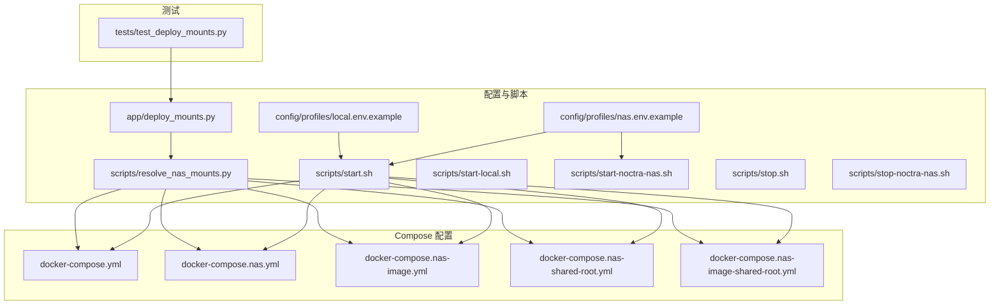
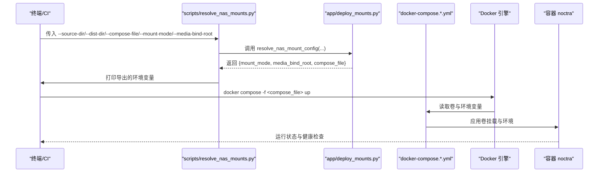
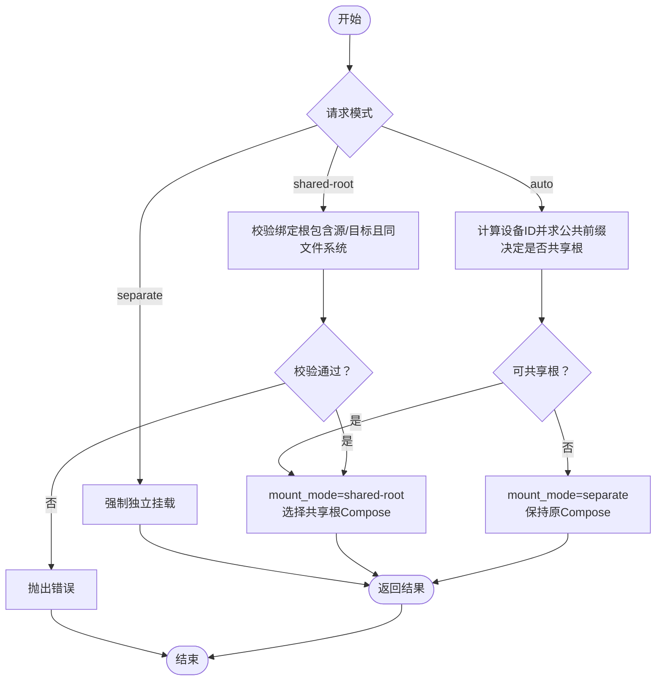
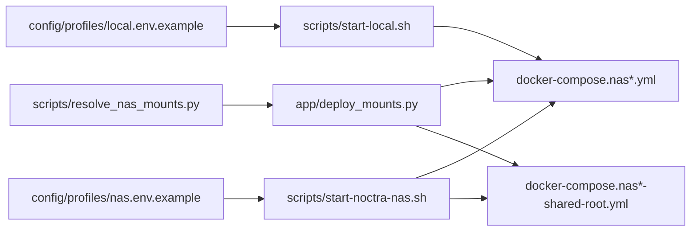

# 挂载点配置

<cite>
**本文引用的文件**
- [app/deploy_mounts.py](file://app/deploy_mounts.py)
- [scripts/resolve_nas_mounts.py](file://scripts/resolve_nas_mounts.py)
- [docker-compose.yml](file://docker-compose.yml)
- [docker-compose.nas.yml](file://docker-compose.nas.yml)
- [docker-compose.nas-image.yml](file://docker-compose.nas-image.yml)
- [docker-compose.nas-shared-root.yml](file://docker-compose.nas-shared-root.yml)
- [docker-compose.nas-image-shared-root.yml](file://docker-compose.nas-image-shared-root.yml)
- [config/profiles/local.env.example](file://config/profiles/local.env.example)
- [config/profiles/nas.env.example](file://config/profiles/nas.env.example)
- [tests/test_deploy_mounts.py](file://tests/test_deploy_mounts.py)
- [scripts/start.sh](file://scripts/start.sh)
- [scripts/start-local.sh](file://scripts/start-local.sh)
- [scripts/start-noctra-nas.sh](file://scripts/start-noctra-nas.sh)
- [scripts/stop.sh](file://scripts/stop.sh)
- [scripts/stop-noctra-nas.sh](file://scripts/stop-noctra-nas.sh)
</cite>

## 目录
1. [简介](#简介)
2. [项目结构](#项目结构)
3. [核心组件](#核心组件)
4. [架构总览](#架构总览)
5. [详细组件分析](#详细组件分析)
6. [依赖关系分析](#依赖关系分析)
7. [性能与可靠性考量](#性能与可靠性考量)
8. [故障排除指南](#故障排除指南)
9. [结论](#结论)
10. [附录：完整挂载配置示例](#附录完整挂载配置示例)

## 简介
本指南聚焦于 Noctra 的挂载点配置，覆盖以下主题：
- Docker 卷挂载、NAS 共享目录与本地文件系统的映射方式
- 不同挂载模式（自动、独立挂载、共享根挂载）的适用场景与安全注意事项
- 完整的挂载配置示例（媒体源目录、目标目录、数据与缓存目录）
- 挂载点验证、权限配置与常见问题排查

## 项目结构
围绕挂载配置的关键文件与职责如下：
- 配置解析与挂载模式决策：app/deploy_mounts.py、scripts/resolve_nas_mounts.py
- Compose 文件族：docker-compose.yml、docker-compose.nas.yml、docker-compose.nas-image.yml、docker-compose.nas-shared-root.yml、docker-compose.nas-image-shared-root.yml
- 环境变量模板：config/profiles/local.env.example、config/profiles/nas.env.example
- 测试用例：tests/test_deploy_mounts.py
- 启停脚本：scripts/start.sh、scripts/start-local.sh、scripts/start-noctra-nas.sh、scripts/stop.sh、scripts/stop-noctra-nas.sh

图表来源
- [app/deploy_mounts.py:1-89](file://app/deploy_mounts.py#L1-L89)
- [scripts/resolve_nas_mounts.py:1-43](file://scripts/resolve_nas_mounts.py#L1-L43)
- [docker-compose.yml:1-28](file://docker-compose.yml#L1-L28)
- [docker-compose.nas.yml:1-33](file://docker-compose.nas.yml#L1-L33)
- [docker-compose.nas-image.yml:1-51](file://docker-compose.nas-image.yml#L1-L51)
- [docker-compose.nas-shared-root.yml:1-35](file://docker-compose.nas-shared-root.yml#L1-L35)
- [docker-compose.nas-image-shared-root.yml:1-53](file://docker-compose.nas-image-shared-root.yml#L1-L53)
- [config/profiles/local.env.example:1-23](file://config/profiles/local.env.example#L1-L23)
- [config/profiles/nas.env.example:1-44](file://config/profiles/nas.env.example#L1-L44)
- [tests/test_deploy_mounts.py:1-101](file://tests/test_deploy_mounts.py#L1-L101)

章节来源
- [app/deploy_mounts.py:1-89](file://app/deploy_mounts.py#L1-L89)
- [scripts/resolve_nas_mounts.py:1-43](file://scripts/resolve_nas_mounts.py#L1-L43)
- [docker-compose.yml:1-28](file://docker-compose.yml#L1-L28)
- [docker-compose.nas.yml:1-33](file://docker-compose.nas.yml#L1-L33)
- [docker-compose.nas-image.yml:1-51](file://docker-compose.nas-image.yml#L1-L51)
- [docker-compose.nas-shared-root.yml:1-35](file://docker-compose.nas-shared-root.yml#L1-L35)
- [docker-compose.nas-image-shared-root.yml:1-53](file://docker-compose.nas-image-shared-root.yml#L1-L53)
- [config/profiles/local.env.example:1-23](file://config/profiles/local.env.example#L1-L23)
- [config/profiles/nas.env.example:1-44](file://config/profiles/nas.env.example#L1-L44)
- [tests/test_deploy_mounts.py:1-101](file://tests/test_deploy_mounts.py#L1-L101)

## 核心组件
- 挂载模式解析器：负责根据源目录与目标目录的文件系统一致性、用户指定模式等，选择合适的 Compose 文件与挂载策略，并输出环境变量供后续脚本使用。
- 命令行入口：scripts/resolve_nas_mounts.py 将解析结果以环境变量形式打印，便于 shell 脚本或 CI 使用。
- Compose 配置族：提供多种挂载模式对应的容器卷定义与环境变量注入。
- 环境变量模板：local.env.example 与 nas.env.example 提供本地与 NAS 部署的默认路径与参数参考。

章节来源
- [app/deploy_mounts.py:57-89](file://app/deploy_mounts.py#L57-L89)
- [scripts/resolve_nas_mounts.py:15-42](file://scripts/resolve_nas_mounts.py#L15-L42)
- [docker-compose.yml:12-15](file://docker-compose.yml#L12-L15)
- [docker-compose.nas.yml:12-15](file://docker-compose.nas.yml#L12-L15)
- [docker-compose.nas-image.yml:10-13](file://docker-compose.nas-image.yml#L10-L13)
- [docker-compose.nas-shared-root.yml:12-14](file://docker-compose.nas-shared-root.yml#L12-L14)
- [docker-compose.nas-image-shared-root.yml:10-12](file://docker-compose.nas-image-shared-root.yml#L10-L12)
- [config/profiles/local.env.example:8-11](file://config/profiles/local.env.example#L8-L11)
- [config/profiles/nas.env.example:8-13](file://config/profiles/nas.env.example#L8-L13)

## 架构总览
下图展示从命令行到容器运行时的挂载决策与执行链路：

图表来源
- [scripts/resolve_nas_mounts.py:24-38](file://scripts/resolve_nas_mounts.py#L24-L38)
- [app/deploy_mounts.py:57-89](file://app/deploy_mounts.py#L57-L89)
- [docker-compose.yml:12-15](file://docker-compose.yml#L12-L15)
- [docker-compose.nas.yml:12-15](file://docker-compose.nas.yml#L12-L15)
- [docker-compose.nas-image.yml:10-13](file://docker-compose.nas-image.yml#L10-L13)
- [docker-compose.nas-shared-root.yml:12-14](file://docker-compose.nas-shared-root.yml#L12-L14)
- [docker-compose.nas-image-shared-root.yml:10-12](file://docker-compose.nas-image-shared-root.yml#L10-L12)

## 详细组件分析

### 组件一：挂载模式解析器（app/deploy_mounts.py）
- 功能要点
  - 自动模式：比较源目录与目标目录所在文件系统的设备 ID，若一致则采用共享根挂载；否则回退为独立挂载。
  - 显式模式：separate 强制独立挂载；shared-root 强制共享根挂载，并校验绑定根必须同时包含源与目标目录，且两者在同一文件系统。
  - 输出：返回最终挂载模式、媒体绑定根路径以及应使用的 Compose 文件名（共享根模式会切换到对应共享根 Compose）。
- 关键算法
  - 设备 ID 比较：用于判断是否位于同一文件系统。
  - 路径包含性校验：确保共享根模式下的绑定根路径包含源与目标目录。
  - Compose 文件名推导：在共享根模式下将 .yml 替换为 -shared-root.yml 或 -shared-root.yaml。

图表来源
- [app/deploy_mounts.py:26-54](file://app/deploy_mounts.py#L26-L54)
- [app/deploy_mounts.py:57-89](file://app/deploy_mounts.py#L57-L89)

章节来源
- [app/deploy_mounts.py:14-54](file://app/deploy_mounts.py#L14-L54)
- [app/deploy_mounts.py:57-89](file://app/deploy_mounts.py#L57-L89)

### 组件二：命令行入口（scripts/resolve_nas_mounts.py）
- 功能要点
  - 解析命令行参数，调用解析器，输出三个环境变量：
    - NOCTRA_SELECTED_MOUNT_MODE：最终挂载模式
    - NOCTRA_SELECTED_COMPOSE_FILE：最终使用的 Compose 文件
    - NOCTRA_MEDIA_BIND_ROOT：共享根模式下的绑定根路径（如存在）
- 使用建议
  - 在 CI 或部署脚本中先执行该脚本，再基于导出的变量执行 docker compose。

章节来源
- [scripts/resolve_nas_mounts.py:15-42](file://scripts/resolve_nas_mounts.py#L15-L42)

### 组件三：Compose 配置族（卷与环境变量）
- docker-compose.yml（开发/本地）
  - 卷：源目录 → /source，目标目录 → /dist，数据目录 → /app/data
  - 环境：NOCTRA_PROFILE=docker
- docker-compose.nas.yml（NAS 开发/本地）
  - 卷：源目录 → /source，目标目录 → /dist，数据目录 → /app/data
  - 环境：NOCTRA_PROFILE=nas-docker
- docker-compose.nas-image.yml（NAS 镜像部署）
  - 卷：源目录 → /source，目标目录 → /dist，数据目录 → /app/data
  - 环境：NOCTRA_PROFILE=nas-docker
- docker-compose.nas-shared-root.yml（NAS 共享根）
  - 卷：绑定根路径 → 绑定根路径（容器内相同路径），数据目录 → /app/data
  - 环境：SOURCE_DIR、DIST_DIR、DB_PATH 注入
- docker-compose.nas-image-shared-root.yml（NAS 镜像共享根）
  - 卷：绑定根路径 → 绑定根路径（容器内相同路径），数据目录 → /app/data
  - 环境：SOURCE_DIR、DIST_DIR、DB_PATH 注入

章节来源
- [docker-compose.yml:12-15](file://docker-compose.yml#L12-L15)
- [docker-compose.nas.yml:12-15](file://docker-compose.nas.yml#L12-L15)
- [docker-compose.nas-image.yml:10-13](file://docker-compose.nas-image.yml#L10-L13)
- [docker-compose.nas-shared-root.yml:12-14](file://docker-compose.nas-shared-root.yml#L12-L14)
- [docker-compose.nas-image-shared-root.yml:10-12](file://docker-compose.nas-image-shared-root.yml#L10-L12)

### 组件四：环境变量模板（本地与 NAS）
- local.env.example
  - 默认路径：NOCTRA_SOURCE_DIR、NOCTRA_DIST_DIR、NOCTRA_DATA_DIR、NOCTRA_DB_PATH
  - 适合本地开发与测试
- nas.env.example
  - NAS 路径：NOCTRA_SOURCE_DIR、NOCTRA_DIST_DIR、NOCTRA_DATA_DIR、NOCTRA_DB_PATH
  - 部署相关：NOCTRA_REMOTE_*、NOCTRA_REMOTE_MOUNT_MODE、NOCTRA_REMOTE_COMPOSE_FILE、NOCTRA_MEDIA_BIND_ROOT 等
  - 适合从本地机器部署到 NAS

章节来源
- [config/profiles/local.env.example:8-11](file://config/profiles/local.env.example#L8-L11)
- [config/profiles/nas.env.example:8-13](file://config/profiles/nas.env.example#L8-L13)
- [config/profiles/nas.env.example:22-27](file://config/profiles/nas.env.example#L22-L27)

### 组件五：挂载模式测试（tests/test_deploy_mounts.py）
- 自动模式：同文件系统 → 共享根；跨文件系统 → 独立挂载
- 显式模式：separate 优先级更高
- 共享根模式：要求绑定根同时包含源与目标目录，否则报错

章节来源
- [tests/test_deploy_mounts.py:8-25](file://tests/test_deploy_mounts.py#L8-L25)
- [tests/test_deploy_mounts.py:27-64](file://tests/test_deploy_mounts.py#L27-L64)
- [tests/test_deploy_mounts.py:66-83](file://tests/test_deploy_mounts.py#L66-L83)
- [tests/test_deploy_mounts.py:85-101](file://tests/test_deploy_mounts.py#L85-L101)

## 依赖关系分析
- 解析器依赖
  - 路径解析：使用 pathlib.Path 与 stat 设备 ID
  - 字符串处理：Compose 文件名替换
- 命令行入口依赖
  - 导入解析器模块并打印环境变量
- Compose 依赖
  - 卷挂载依赖环境变量中的路径
  - 共享根模式依赖 NOCTRA_MEDIA_BIND_ROOT 与 SOURCE_DIR/DIST_DIR 的注入
- 测试依赖
  - 通过伪造设备 ID 等手段验证解析逻辑

图表来源
- [scripts/resolve_nas_mounts.py:12](file://scripts/resolve_nas_mounts.py#L12)
- [app/deploy_mounts.py:57-89](file://app/deploy_mounts.py#L57-L89)
- [docker-compose.nas.yml:12-15](file://docker-compose.nas.yml#L12-L15)
- [docker-compose.nas-shared-root.yml:12-14](file://docker-compose.nas-shared-root.yml#L12-L14)
- [config/profiles/local.env.example:1-23](file://config/profiles/local.env.example#L1-L23)
- [config/profiles/nas.env.example:1-44](file://config/profiles/nas.env.example#L1-L44)
- [scripts/start-local.sh:6](file://scripts/start-local.sh#L6)
- [scripts/start-noctra-nas.sh:6](file://scripts/start-noctra-nas.sh#L6)

章节来源
- [scripts/resolve_nas_mounts.py:12](file://scripts/resolve_nas_mounts.py#L12)
- [app/deploy_mounts.py:57-89](file://app/deploy_mounts.py#L57-L89)
- [docker-compose.nas.yml:12-15](file://docker-compose.nas.yml#L12-L15)
- [docker-compose.nas-shared-root.yml:12-14](file://docker-compose.nas-shared-root.yml#L12-L14)
- [config/profiles/local.env.example:1-23](file://config/profiles/local.env.example#L1-L23)
- [config/profiles/nas.env.example:1-44](file://config/profiles/nas.env.example#L1-L44)
- [scripts/start-local.sh:6](file://scripts/start-local.sh#L6)
- [scripts/start-noctra-nas.sh:6](file://scripts/start-noctra-nas.sh#L6)

## 性能与可靠性考量
- 文件系统一致性
  - 共享根模式要求源与目标目录位于同一文件系统，避免跨文件系统挂载导致的性能与一致性问题。
- 卷数量与 I/O
  - 独立挂载模式下，源与目标分别挂载，I/O 可能更分散；共享根模式减少卷数量，但需确保绑定根路径具备足够权限与磁盘空间。
- Compose 切换
  - 共享根模式会切换到对应的共享根 Compose 文件，注意确认镜像与构建上下文差异（如镜像部署 vs 构建部署）。
- 资源限制
  - NAS 相关 Compose 文件包含 CPU 与内存限制，可根据实际硬件能力调整。

[本节为通用指导，不直接分析具体文件]

## 故障排除指南
- 错误：未设置必要的环境变量
  - 症状：Compose 启动时报缺少环境变量（如 NOCTRA_SOURCE_DIR、NOCTRA_DIST_DIR、NOCTRA_MEDIA_BIND_ROOT）
  - 处理：参考环境变量模板，补齐路径与模式参数
  - 参考
    - [config/profiles/local.env.example:8-11](file://config/profiles/local.env.example#L8-L11)
    - [config/profiles/nas.env.example:8-13](file://config/profiles/nas.env.example#L8-L13)
    - [config/profiles/nas.env.example:27](file://config/profiles/nas.env.example#L27)
- 错误：共享根模式校验失败
  - 症状：提示绑定根必须同时包含源与目标目录，或要求源与目标在同一文件系统
  - 处理：调整 NOCTRA_MEDIA_BIND_ROOT 或改用 separate 模式
  - 参考
    - [app/deploy_mounts.py:40-54](file://app/deploy_mounts.py#L40-L54)
    - [tests/test_deploy_mounts.py:85-101](file://tests/test_deploy_mounts.py#L85-L101)
- 错误：跨文件系统导致自动模式回退为独立挂载
  - 症状：期望共享根但实际为独立挂载
  - 处理：显式设置 mount 模式为 shared-root 并确保路径满足条件，或将源/目标迁移到同一文件系统
  - 参考
    - [tests/test_deploy_mounts.py:27-64](file://tests/test_deploy_mounts.py#L27-L64)
- 启动失败
  - 症状：服务无法启动或健康检查失败
  - 处理：查看日志、确认端口占用、确认卷权限与路径正确
  - 参考
    - [scripts/start.sh:32-41](file://scripts/start.sh#L32-L41)
    - [scripts/stop.sh:11-18](file://scripts/stop.sh#L11-L18)

章节来源
- [config/profiles/local.env.example:8-11](file://config/profiles/local.env.example#L8-L11)
- [config/profiles/nas.env.example:8-13](file://config/profiles/nas.env.example#L8-L13)
- [config/profiles/nas.env.example:27](file://config/profiles/nas.env.example#L27)
- [app/deploy_mounts.py:40-54](file://app/deploy_mounts.py#L40-L54)
- [tests/test_deploy_mounts.py:27-64](file://tests/test_deploy_mounts.py#L27-L64)
- [tests/test_deploy_mounts.py:85-101](file://tests/test_deploy_mounts.py#L85-L101)
- [scripts/start.sh:32-41](file://scripts/start.sh#L32-L41)
- [scripts/stop.sh:11-18](file://scripts/stop.sh#L11-L18)

## 结论
- 自动模式优先保证性能与一致性，推荐在源/目标位于同一文件系统时使用
- 共享根模式减少卷数量、简化路径管理，但需要严格的路径与文件系统约束
- 独立挂载模式最灵活，适用于跨文件系统或多卷场景
- 建议在生产环境明确挂载模式与绑定根路径，并结合 NAS 部署参数进行统一配置

[本节为总结，不直接分析具体文件]

## 附录：完整挂载配置示例
- 本地开发（Docker Compose）
  - 步骤
    - 复制并编辑本地环境变量模板，设置源目录、目标目录与数据目录
    - 使用 docker-compose.yml 启动
  - 参考
    - [config/profiles/local.env.example:8-11](file://config/profiles/local.env.example#L8-L11)
    - [docker-compose.yml:12-15](file://docker-compose.yml#L12-L15)
- NAS 部署（独立挂载）
  - 步骤
    - 复制并编辑 NAS 环境变量模板，设置源目录、目标目录、数据目录与远程部署参数
    - 使用 docker-compose.nas.yml 或 docker-compose.nas-image.yml 启动
  - 参考
    - [config/profiles/nas.env.example:8-13](file://config/profiles/nas.env.example#L8-L13)
    - [config/profiles/nas.env.example:22-27](file://config/profiles/nas.env.example#L22-L27)
    - [docker-compose.nas.yml:12-15](file://docker-compose.nas.yml#L12-L15)
    - [docker-compose.nas-image.yml:10-13](file://docker-compose.nas-image.yml#L10-L13)
- NAS 部署（共享根挂载）
  - 步骤
    - 设置 NOCTRA_MEDIA_BIND_ROOT 为包含源与目标目录的公共根路径
    - 使用 docker-compose.nas-shared-root.yml 或 docker-compose.nas-image-shared-root.yml 启动
  - 参考
    - [config/profiles/nas.env.example:27](file://config/profiles/nas.env.example#L27)
    - [docker-compose.nas-shared-root.yml:12-14](file://docker-compose.nas-shared-root.yml#L12-L14)
    - [docker-compose.nas-image-shared-root.yml:10-12](file://docker-compose.nas-image-shared-root.yml#L10-L12)
- 挂载点验证与权限
  - 验证
    - 确认容器内 /source 与 /dist 路径可访问
    - 确认 /app/data 可写
  - 权限
    - 确保运行用户对源/目标目录与数据目录具有读写权限
    - 若使用共享根，确保绑定根路径具备相应权限
  - 参考
    - [docker-compose.yml:12-15](file://docker-compose.yml#L12-L15)
    - [docker-compose.nas.yml:12-15](file://docker-compose.nas.yml#L12-L15)
    - [docker-compose.nas-image.yml:10-13](file://docker-compose.nas-image.yml#L10-L13)
    - [docker-compose.nas-shared-root.yml:12-14](file://docker-compose.nas-shared-root.yml#L12-L14)
    - [docker-compose.nas-image-shared-root.yml:10-12](file://docker-compose.nas-image-shared-root.yml#L10-L12)

章节来源
- [config/profiles/local.env.example:8-11](file://config/profiles/local.env.example#L8-L11)
- [config/profiles/nas.env.example:8-13](file://config/profiles/nas.env.example#L8-L13)
- [config/profiles/nas.env.example:22-27](file://config/profiles/nas.env.example#L22-L27)
- [docker-compose.yml:12-15](file://docker-compose.yml#L12-L15)
- [docker-compose.nas.yml:12-15](file://docker-compose.nas.yml#L12-L15)
- [docker-compose.nas-image.yml:10-13](file://docker-compose.nas-image.yml#L10-L13)
- [docker-compose.nas-shared-root.yml:12-14](file://docker-compose.nas-shared-root.yml#L12-L14)
- [docker-compose.nas-image-shared-root.yml:10-12](file://docker-compose.nas-image-shared-root.yml#L10-L12)