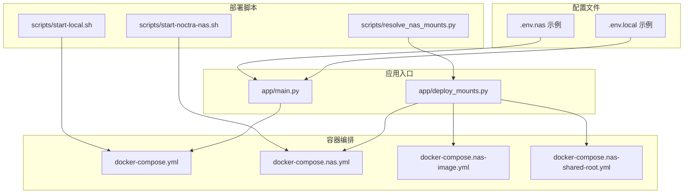
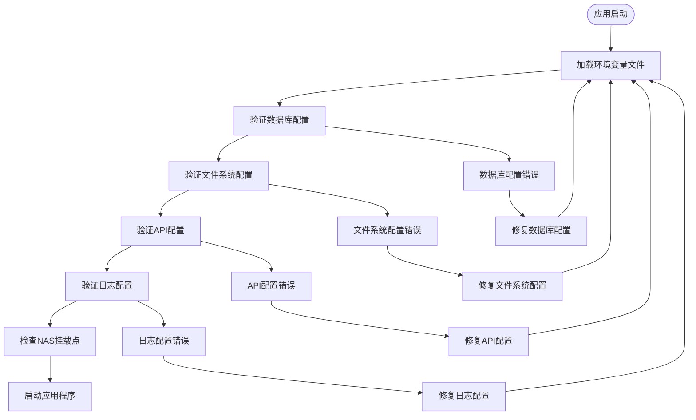
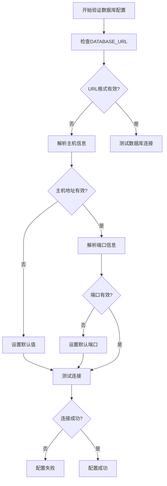
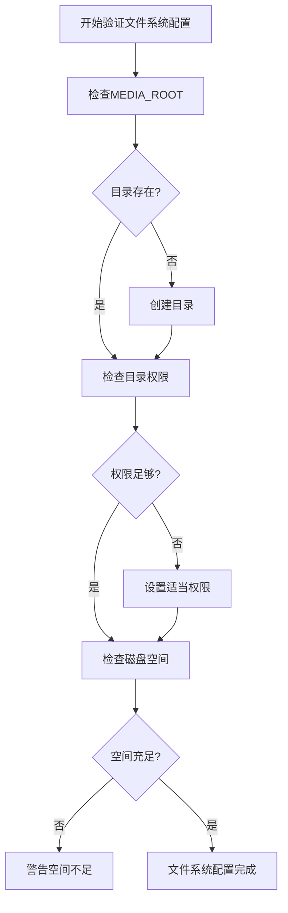
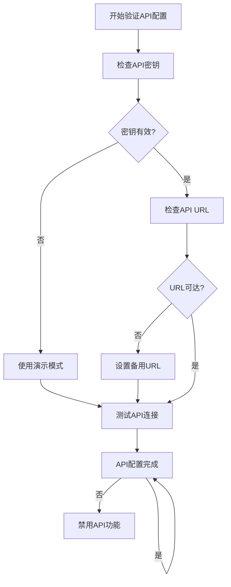
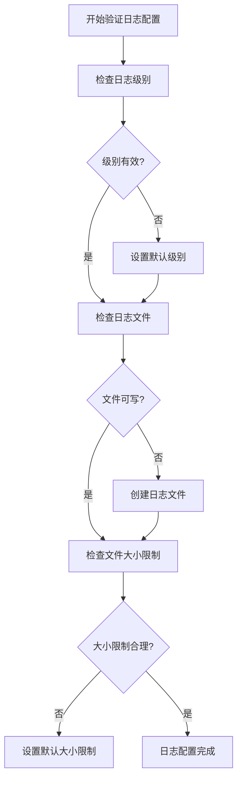
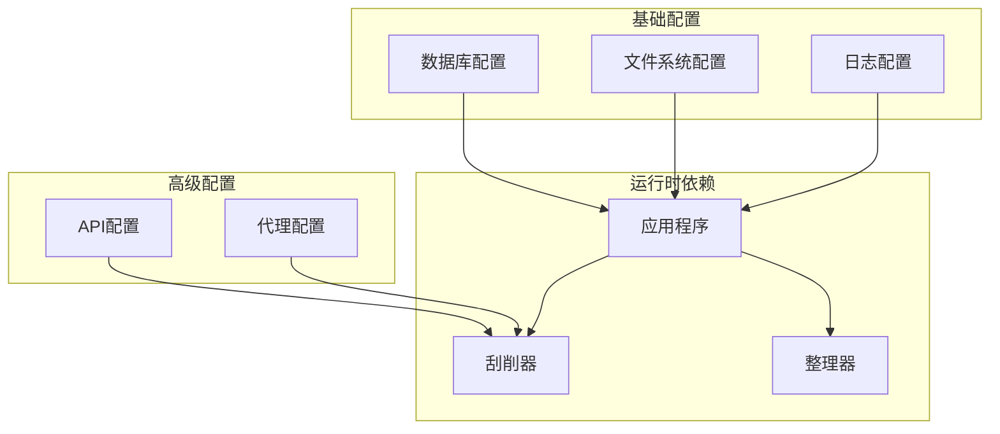
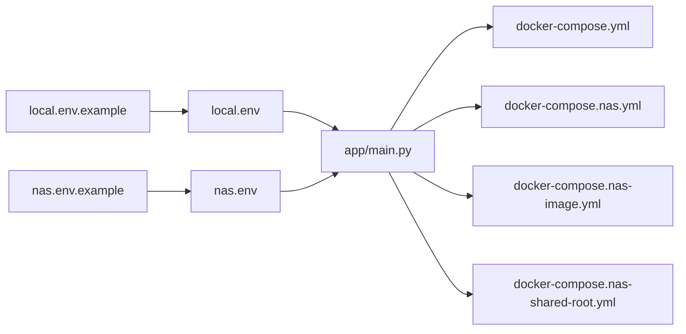
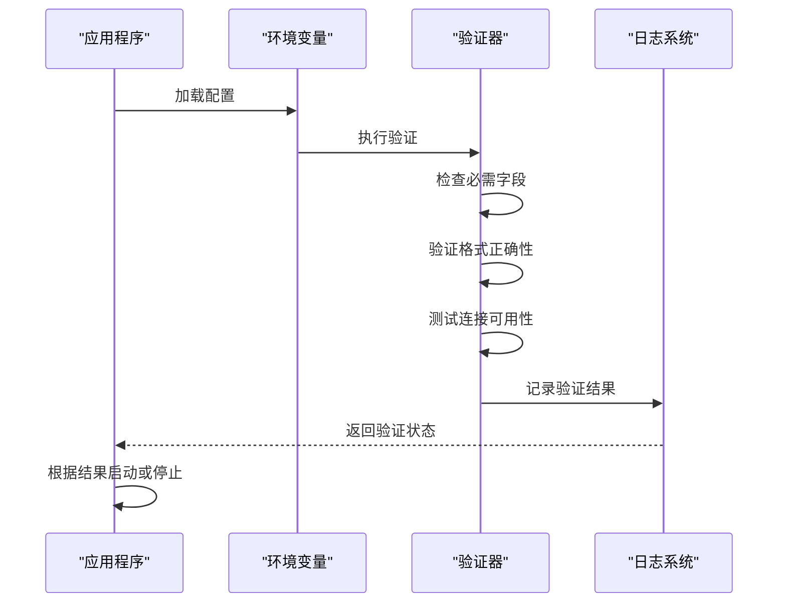

# 环境变量配置

<cite>
**本文档引用的文件**
- [local.env.example](file://config/profiles/local.env.example)
- [nas.env.example](file://config/profiles/nas.env.example)
- [local.env](file://config/profiles/local.env)
- [nas.env](file://config/profiles/nas.env)
- [main.py](file://app/main.py)
- [deploy_mounts.py](file://app/deploy_mounts.py)
- [docker-compose.yml](file://docker-compose.yml)
- [docker-compose.nas.yml](file://docker-compose.nas.yml)
- [docker-compose.nas-image.yml](file://docker-compose.nas-image.yml)
- [docker-compose.nas-shared-root.yml](file://docker-compose.nas-shared-root.yml)
- [start-local.sh](file://scripts/start-local.sh)
- [start-noctra-nas.sh](file://scripts/start-noctra-nas.sh)
- [resolve_nas_mounts.py](file://scripts/resolve_nas_mounts.py)
- [local-startup.md](file://docs/local-startup.md)
- [nas-deployment.md](file://docs/nas-deployment.md)
</cite>

## 目录
1. [简介](#简介)
2. [项目结构](#项目结构)
3. [核心组件](#核心组件)
4. [架构概览](#架构概览)
5. [详细组件分析](#详细组件分析)
6. [依赖关系分析](#依赖关系分析)
7. [性能考虑](#性能考虑)
8. [故障排除指南](#故障排除指南)
9. [结论](#结论)
10. [附录](#附录)

## 简介
本文件为Noctra项目的环境变量配置详细文档。Noctra是一个视频内容整理与元数据抓取系统，支持本地开发与NAS部署两种模式。本文档将详细说明所有可用的环境变量参数，包括数据库连接、API密钥、文件路径和日志级别等配置项，并提供本地开发环境和NAS部署环境的具体配置示例。

## 项目结构
Noctra项目采用模块化设计，环境变量主要通过以下方式管理：
- 配置文件：位于config/profiles目录下的.env.example文件
- 应用入口：app/main.py负责加载和验证环境变量
- 部署脚本：scripts目录下包含启动和部署相关脚本
- 容器编排：docker-compose文件定义服务配置

**图表来源**
- [main.py](file://app/main.py)
- [deploy_mounts.py](file://app/deploy_mounts.py)
- [docker-compose.yml](file://docker-compose.yml)
- [docker-compose.nas.yml](file://docker-compose.nas.yml)

**章节来源**
- [main.py](file://app/main.py)
- [deploy_mounts.py](file://app/deploy_mounts.py)

## 核心组件
Noctra的环境变量配置主要涉及以下几个核心组件：

### 数据库配置组件
负责管理数据库连接和存储相关的环境变量，确保应用能够正确连接到数据库并执行数据操作。

### 文件系统配置组件
管理媒体文件、缓存文件和日志文件的存储路径配置，确保文件系统的正确访问和权限设置。

### API配置组件
包含外部服务API密钥和认证信息，如JAVDB等元数据服务的访问凭证。

### 日志配置组件
控制应用程序的日志级别和输出格式，便于调试和监控。

**章节来源**
- [main.py](file://app/main.py)
- [deploy_mounts.py](file://app/deploy_mounts.py)

## 架构概览
Noctra的环境变量架构采用分层设计，从基础配置到具体实现逐层展开：

**图表来源**
- [main.py](file://app/main.py)
- [deploy_mounts.py](file://app/deploy_mounts.py)

## 详细组件分析

### 数据库配置组件

#### 关键环境变量
- DATABASE_URL：完整的数据库连接字符串
- DB_HOST：数据库主机地址
- DB_PORT：数据库端口号
- DB_NAME：数据库名称
- DB_USER：数据库用户名
- DB_PASSWORD：数据库密码
- DB_POOL_SIZE：数据库连接池大小

#### 配置验证流程

**图表来源**
- [main.py](file://app/main.py)

#### 默认值和推荐设置
- DATABASE_URL：优先使用完整连接字符串
- DB_HOST：localhost或127.0.0.1
- DB_PORT：5432（PostgreSQL默认端口）
- DB_POOL_SIZE：10个连接

**章节来源**
- [main.py](file://app/main.py)

### 文件系统配置组件

#### 关键环境变量
- MEDIA_ROOT：媒体文件根目录
- CACHE_DIR：缓存文件目录
- LOG_DIR：日志文件目录
- TEMP_DIR：临时文件目录
- NAS_MOUNT_POINT：NAS挂载点路径

#### 配置验证流程

**图表来源**
- [deploy_mounts.py](file://app/deploy_mounts.py)

#### 默认值和推荐设置
- MEDIA_ROOT：/data/media
- CACHE_DIR：/data/cache
- LOG_DIR：/data/logs
- TEMP_DIR：/tmp/noctra

**章节来源**
- [deploy_mounts.py](file://app/deploy_mounts.py)

### API配置组件

#### 关键环境变量
- JAVDB_API_KEY：JAVDB API密钥
- JAVDB_BASE_URL：JAVDB API基础URL
- PROXY_ENABLED：代理启用开关
- PROXY_HOST：代理服务器地址
- PROXY_PORT：代理服务器端口

#### 配置验证流程

**图表来源**
- [main.py](file://app/main.py)

#### 默认值和推荐设置
- JAVDB_API_KEY：留空以使用公开API
- JAVDB_BASE_URL：https://api.javdb.com
- PROXY_ENABLED：false

**章节来源**
- [main.py](file://app/main.py)

### 日志配置组件

#### 关键环境变量
- LOG_LEVEL：日志级别（DEBUG/INFO/WARNING/ERROR）
- LOG_FILE：日志文件路径
- LOG_MAX_SIZE：单个日志文件最大大小
- LOG_BACKUP_COUNT：日志文件备份数量

#### 配置验证流程

**图表来源**
- [main.py](file://app/main.py)

#### 默认值和推荐设置
- LOG_LEVEL：INFO
- LOG_MAX_SIZE：50MB
- LOG_BACKUP_COUNT：5

**章节来源**
- [main.py](file://app/main.py)

## 依赖关系分析

### 环境变量依赖图

**图表来源**
- [main.py](file://app/main.py)
- [deploy_mounts.py](file://app/deploy_mounts.py)

### 配置文件依赖关系

**图表来源**
- [local.env.example](file://config/profiles/local.env.example)
- [nas.env.example](file://config/profiles/nas.env.example)
- [main.py](file://app/main.py)

**章节来源**
- [docker-compose.yml](file://docker-compose.yml)
- [docker-compose.nas.yml](file://docker-compose.nas.yml)

## 性能考虑
环境变量配置对Noctra性能的影响主要体现在以下几个方面：

### 数据库连接优化
- 连接池大小应根据系统资源和并发需求调整
- 合理设置超时时间和重试机制
- 使用连接复用减少建立连接的开销

### 文件系统性能
- 缓存目录应使用高性能存储介质
- 日志文件应避免频繁写入影响I/O性能
- 媒体文件存储应考虑网络延迟和带宽限制

### API调用性能
- 合理设置API请求频率和并发数
- 实现请求缓存机制减少重复调用
- 使用代理服务器提高访问速度

## 故障排除指南

### 常见配置错误及解决方案

#### 数据库连接问题
**症状**：应用启动时数据库连接失败
**可能原因**：
- DATABASE_URL格式不正确
- 数据库服务未启动
- 用户权限不足

**解决步骤**：
1. 验证DATABASE_URL格式是否符合标准连接字符串格式
2. 检查数据库服务状态和监听端口
3. 确认数据库用户具有足够的连接权限

#### 文件系统权限问题
**症状**：无法读取或写入媒体文件
**可能原因**：
- 目录权限设置不正确
- 磁盘空间不足
- NAS挂载点不可访问

**解决步骤**：
1. 检查MEDIA_ROOT目录的读写权限
2. 确认磁盘空间充足且可写
3. 验证NAS挂载点的网络连接和认证

#### API访问问题
**症状**：元数据抓取失败或响应缓慢
**可能原因**：
- API密钥无效或过期
- 网络连接不稳定
- 代理服务器配置错误

**解决步骤**：
1. 验证JAVDB_API_KEY的有效性
2. 测试网络连接和DNS解析
3. 检查代理服务器的连通性和认证

#### 日志配置问题
**症状**：日志文件无法生成或记录不完整
**可能原因**：
- 日志目录权限不足
- 日志文件被其他进程占用
- 磁盘空间已满

**解决步骤**：
1. 检查LOG_DIR目录的写入权限
2. 确认日志文件没有被意外删除或移动
3. 清理磁盘空间或调整日志轮转策略

### 配置验证方法

#### 自动验证流程

**图表来源**
- [main.py](file://app/main.py)

#### 手动验证步骤
1. **语法验证**：检查.env文件的语法格式
2. **连通性测试**：验证网络连接和服务可用性
3. **权限检查**：确认文件系统权限设置正确
4. **功能测试**：运行基本功能测试验证配置有效性

**章节来源**
- [main.py](file://app/main.py)
- [deploy_mounts.py](file://app/deploy_mounts.py)

## 结论
Noctra的环境变量配置提供了灵活而强大的系统定制能力。通过合理的配置管理，可以满足从本地开发到生产部署的各种场景需求。建议在部署前仔细阅读本指南，按照推荐的配置进行设置，并定期检查配置的有效性和安全性。

## 附录

### 本地开发环境配置示例

#### 配置文件模板
参考文件：config/profiles/local.env.example

#### 推荐配置
- 数据库：使用SQLite或本地PostgreSQL实例
- 文件系统：使用本地目录作为媒体根目录
- 日志：设置INFO级别以便调试
- API：使用公开API无需密钥

#### 启动脚本
参考文件：scripts/start-local.sh

### NAS部署环境配置示例

#### 配置文件模板
参考文件：config/profiles/nas.env.example

#### 推荐配置
- 数据库：使用远程数据库服务
- 文件系统：配置NAS共享存储
- 日志：设置适当的轮转策略
- API：配置代理服务器提高访问速度

#### 部署脚本
参考文件：scripts/start-noctra-nas.sh

### 配置最佳实践

#### 安全性考虑
- 不要在配置文件中存储明文密码
- 使用环境变量管理敏感信息
- 定期轮换API密钥和数据库密码

#### 可维护性考虑
- 为不同环境创建独立的配置文件
- 使用版本控制系统管理配置变更
- 建立配置变更审批流程

#### 性能优化考虑
- 根据硬件资源调整连接池大小
- 优化文件系统布局提高I/O性能
- 合理设置日志级别平衡信息量和性能

**章节来源**
- [local.env.example](file://config/profiles/local.env.example)
- [nas.env.example](file://config/profiles/nas.env.example)
- [local.env](file://config/profiles/local.env)
- [nas.env](file://config/profiles/nas.env)
- [start-local.sh](file://scripts/start-local.sh)
- [start-noctra-nas.sh](file://scripts/start-noctra-nas.sh)
- [local-startup.md](file://docs/local-startup.md)
- [nas-deployment.md](file://docs/nas-deployment.md)