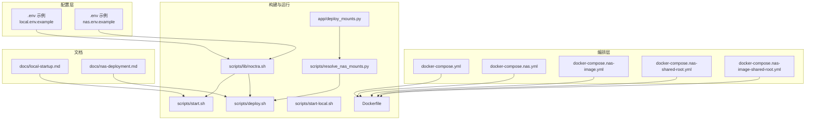
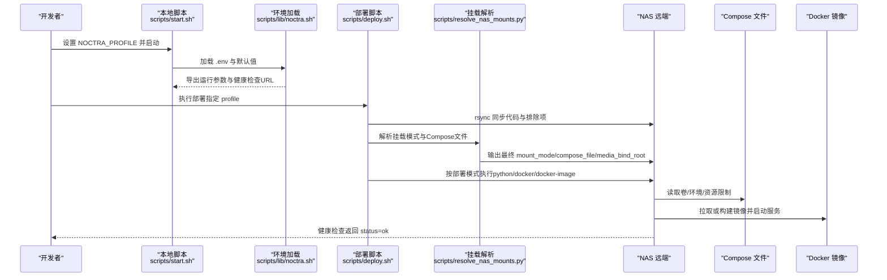
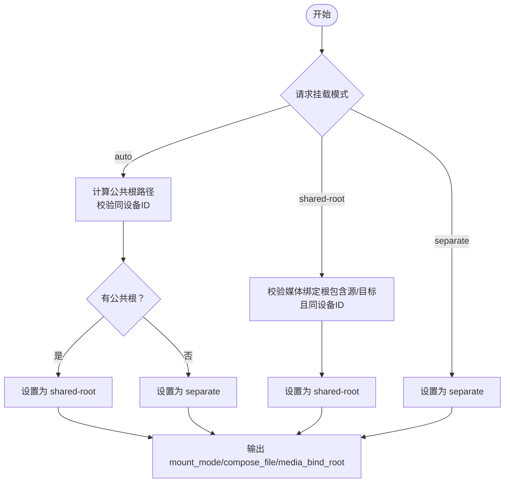
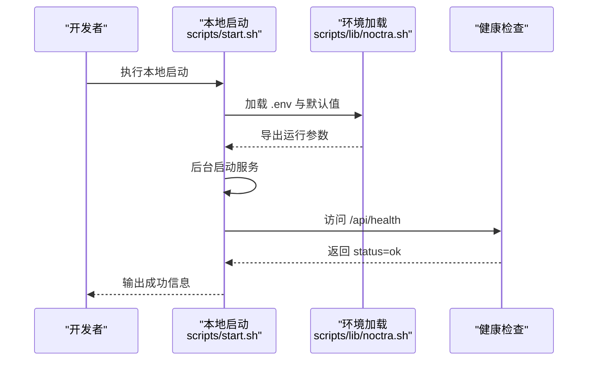
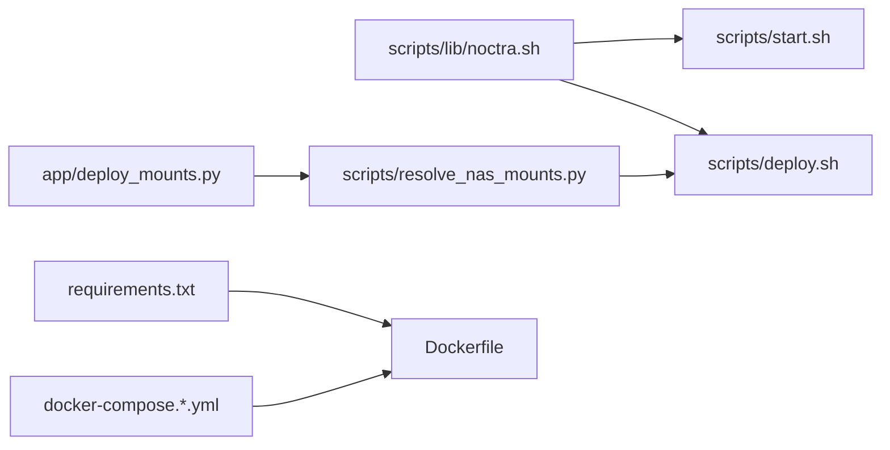

# 部署配置模板

<cite>
**本文引用的文件**
- [config/profiles/local.env.example](file://config/profiles/local.env.example)
- [config/profiles/nas.env.example](file://config/profiles/nas.env.example)
- [docker-compose.yml](file://docker-compose.yml)
- [docker-compose.nas.yml](file://docker-compose.nas.yml)
- [docker-compose.nas-image.yml](file://docker-compose.nas-image.yml)
- [docker-compose.nas-shared-root.yml](file://docker-compose.nas-shared-root.yml)
- [docker-compose.nas-image-shared-root.yml](file://docker-compose.nas-image-shared-root.yml)
- [Dockerfile](file://Dockerfile)
- [scripts/lib/noctra.sh](file://scripts/lib/noctra.sh)
- [scripts/start.sh](file://scripts/start.sh)
- [scripts/start-local.sh](file://scripts/start-local.sh)
- [scripts/deploy.sh](file://scripts/deploy.sh)
- [scripts/resolve_nas_mounts.py](file://scripts/resolve_nas_mounts.py)
- [app/deploy_mounts.py](file://app/deploy_mounts.py)
- [docs/nas-deployment.md](file://docs/nas-deployment.md)
- [docs/local-startup.md](file://docs/local-startup.md)
- [requirements.txt](file://requirements.txt)
</cite>

## 目录
1. [简介](#简介)
2. [项目结构](#项目结构)
3. [核心组件](#核心组件)
4. [架构总览](#架构总览)
5. [详细组件分析](#详细组件分析)
6. [依赖关系分析](#依赖关系分析)
7. [性能与资源建议](#性能与资源建议)
8. [故障排查指南](#故障排查指南)
9. [结论](#结论)
10. [附录：配置模板与操作指南](#附录配置模板与操作指南)

## 简介
本文件面向Noctra在不同部署场景下的配置模板与操作指南，覆盖本地开发、NAS部署与生产环境（镜像模式）三类标准配置，并对各配置文件的差异、适用场景、生成与修改流程、版本管理策略、自定义与扩展方法，以及配置迁移、备份与恢复流程进行系统性说明。目标是帮助用户快速、安全地完成从本地到NAS再到生产的部署与运维。

## 项目结构
围绕部署与配置的关键文件组织如下：
- 配置文件模板：config/profiles/local.env.example、config/profiles/nas.env.example
- Compose编排：docker-compose.yml、docker-compose.nas.yml、docker-compose.nas-image.yml、docker-compose.nas-shared-root.yml、docker-compose.nas-image-shared-root.yml
- 构建与运行：Dockerfile、scripts/lib/noctra.sh、scripts/start.sh、scripts/start-local.sh、scripts/deploy.sh、scripts/resolve_nas_mounts.py
- 文档参考：docs/nas-deployment.md、docs/local-startup.md
- 运行时依赖：requirements.txt

图表来源
- [config/profiles/local.env.example:1-23](file://config/profiles/local.env.example#L1-L23)
- [config/profiles/nas.env.example:1-44](file://config/profiles/nas.env.example#L1-L44)
- [docker-compose.yml:1-28](file://docker-compose.yml#L1-L28)
- [docker-compose.nas.yml:1-33](file://docker-compose.nas.yml#L1-L33)
- [docker-compose.nas-image.yml:1-51](file://docker-compose.nas-image.yml#L1-L51)
- [docker-compose.nas-shared-root.yml:1-35](file://docker-compose.nas-shared-root.yml#L1-L35)
- [docker-compose.nas-image-shared-root.yml:1-53](file://docker-compose.nas-image-shared-root.yml#L1-L53)
- [Dockerfile:1-31](file://Dockerfile#L1-L31)
- [scripts/lib/noctra.sh:1-148](file://scripts/lib/noctra.sh#L1-L148)
- [scripts/start.sh:1-42](file://scripts/start.sh#L1-L42)
- [scripts/start-local.sh:1-9](file://scripts/start-local.sh#L1-L9)
- [scripts/deploy.sh:1-106](file://scripts/deploy.sh#L1-L106)
- [scripts/resolve_nas_mounts.py:1-43](file://scripts/resolve_nas_mounts.py#L1-L43)
- [app/deploy_mounts.py:1-89](file://app/deploy_mounts.py#L1-L89)
- [docs/local-startup.md:1-99](file://docs/local-startup.md#L1-L99)
- [docs/nas-deployment.md:1-125](file://docs/nas-deployment.md#L1-L125)

章节来源
- [config/profiles/local.env.example:1-23](file://config/profiles/local.env.example#L1-L23)
- [config/profiles/nas.env.example:1-44](file://config/profiles/nas.env.example#L1-L44)
- [docker-compose.yml:1-28](file://docker-compose.yml#L1-L28)
- [docker-compose.nas.yml:1-33](file://docker-compose.nas.yml#L1-L33)
- [docker-compose.nas-image.yml:1-51](file://docker-compose.nas-image.yml#L1-L51)
- [docker-compose.nas-shared-root.yml:1-35](file://docker-compose.nas-shared-root.yml#L1-L35)
- [docker-compose.nas-image-shared-root.yml:1-53](file://docker-compose.nas-image-shared-root.yml#L1-L53)
- [Dockerfile:1-31](file://Dockerfile#L1-L31)
- [scripts/lib/noctra.sh:1-148](file://scripts/lib/noctra.sh#L1-L148)
- [scripts/start.sh:1-42](file://scripts/start.sh#L1-L42)
- [scripts/start-local.sh:1-9](file://scripts/start-local.sh#L1-L9)
- [scripts/deploy.sh:1-106](file://scripts/deploy.sh#L1-L106)
- [scripts/resolve_nas_mounts.py:1-43](file://scripts/resolve_nas_mounts.py#L1-L43)
- [app/deploy_mounts.py:1-89](file://app/deploy_mounts.py#L1-L89)
- [docs/local-startup.md:1-99](file://docs/local-startup.md#L1-L99)
- [docs/nas-deployment.md:1-125](file://docs/nas-deployment.md#L1-L125)

## 核心组件
- 配置加载与默认值：scripts/lib/noctra.sh负责加载profile文件、设置默认值、导出运行所需环境变量（主机、端口、源/目标路径、数据库路径、日志与PID文件等），并提供健康检查URL、远程部署参数等。
- 本地启动：scripts/start.sh基于noctra.sh加载配置，检测进程状态，后台启动Uvicorn服务并通过健康检查。
- NAS部署：scripts/deploy.sh负责将代码与profile同步至远端，解析挂载模式与Compose文件，按部署模式（python、docker、docker-image）在远端执行。
- NAS挂载解析：scripts/resolve_nas_mounts.py调用app/deploy_mounts.py实现自动/共享根/分离三种挂载模式选择，并输出最终Compose文件与媒体绑定根路径。
- 编排与镜像：docker-compose.*.yml定义服务、端口映射、卷挂载、环境变量与资源限制；Dockerfile定义基础镜像、pip源参数、安装依赖与入口命令。

章节来源
- [scripts/lib/noctra.sh:13-73](file://scripts/lib/noctra.sh#L13-L73)
- [scripts/start.sh:9-31](file://scripts/start.sh#L9-L31)
- [scripts/deploy.sh:12-102](file://scripts/deploy.sh#L12-L102)
- [scripts/resolve_nas_mounts.py:24-38](file://scripts/resolve_nas_mounts.py#L24-L38)
- [app/deploy_mounts.py:57-89](file://app/deploy_mounts.py#L57-L89)
- [docker-compose.yml:1-28](file://docker-compose.yml#L1-L28)
- [Dockerfile:1-31](file://Dockerfile#L1-L31)

## 架构总览
下图展示从本地到NAS的部署流程与关键配置交互：

图表来源
- [scripts/start.sh:9-31](file://scripts/start.sh#L9-L31)
- [scripts/lib/noctra.sh:13-73](file://scripts/lib/noctra.sh#L13-L73)
- [scripts/deploy.sh:49-102](file://scripts/deploy.sh#L49-L102)
- [scripts/resolve_nas_mounts.py:24-38](file://scripts/resolve_nas_mounts.py#L24-L38)
- [docker-compose.nas-image.yml:1-51](file://docker-compose.nas-image.yml#L1-L51)
- [docs/nas-deployment.md:50-58](file://docs/nas-deployment.md#L50-L58)

## 详细组件分析

### 组件A：本地开发配置模板（local.env）
- 适用场景：本地开发与调试，最小化配置即可启动。
- 关键字段与默认行为：
  - 绑定主机与端口：默认仅监听本地回环，便于本机调试。
  - 源/目标/数据目录：默认指向仓库内测试数据与data目录。
  - 可选字段：可选Python二进制、LLM相关开关与模型参数。
- 生成与修改：
  - 复制示例文件为local.env，仅在需要覆盖默认值时修改。
  - 本地启动脚本会自动加载该文件并导出运行参数。
- 版本管理建议：
  - 将local.env纳入版本控制，但仅提交必要的最小差异；如需机密信息，使用环境注入而非硬编码。

章节来源
- [config/profiles/local.env.example:1-23](file://config/profiles/local.env.example#L1-L23)
- [scripts/lib/noctra.sh:13-32](file://scripts/lib/noctra.sh#L13-L32)
- [docs/local-startup.md:20-31](file://docs/local-startup.md#L20-L31)

### 组件B：NAS部署配置模板（nas.env）
- 适用场景：从本地机器部署到NAS，支持多种部署模式与挂载策略。
- 关键字段与默认行为：
  - 绑定主机与端口：对外暴露服务，便于NAS网络访问。
  - 源/目标/数据目录：指向NAS上的实际媒体与数据卷。
  - 远端部署参数：远程主机、路径、Python二进制、部署模式、Compose文件、Docker项目名等。
  - 代理与镜像：HTTP/HTTPS代理、Watchtower镜像与调度、时区、pip源等。
- 生成与修改：
  - 复制示例文件为nas.env，至少确认源/目标/数据目录、远程主机与路径、部署模式与挂载模式。
  - 使用部署脚本触发挂载解析，自动选择合适的Compose文件。
- 版本管理建议：
  - 将nas.env纳入版本控制，但敏感信息（如API Key）建议通过外部环境注入或Secrets管理。

章节来源
- [config/profiles/nas.env.example:1-44](file://config/profiles/nas.env.example#L1-L44)
- [scripts/lib/noctra.sh:42-53](file://scripts/lib/noctra.sh#L42-L53)
- [docs/nas-deployment.md:25-48](file://docs/nas-deployment.md#L25-L48)

### 组件C：Compose编排模板对比
- docker-compose.yml（通用）：适用于本地或容器内开发，支持通过环境变量注入源/目标/数据路径与LLM参数。
- docker-compose.nas.yml：NAS容器模式，支持CPU/内存限制与代理环境变量。
- docker-compose.nas-image.yml：NAS镜像模式，集成Watchtower自动更新，适合生产稳定运行。
- docker-compose.nas-shared-root.yml：共享根挂载模式，减少跨盘rename，提升重命名性能。
- docker-compose.nas-image-shared-root.yml：镜像模式+共享根挂载，结合Watchtower与优化挂载策略。

章节来源
- [docker-compose.yml:1-28](file://docker-compose.yml#L1-L28)
- [docker-compose.nas.yml:1-33](file://docker-compose.nas.yml#L1-L33)
- [docker-compose.nas-image.yml:1-51](file://docker-compose.nas-image.yml#L1-L51)
- [docker-compose.nas-shared-root.yml:1-35](file://docker-compose.nas-shared-root.yml#L1-L35)
- [docker-compose.nas-image-shared-root.yml:1-53](file://docker-compose.nas-image-shared-root.yml#L1-L53)

### 组件D：挂载模式解析与选择
- 模式说明：
  - auto：自动判断是否可使用共享根挂载；若源/目标在同一文件系统且存在公共根路径，则采用共享根以保留rename能力。
  - separate：始终使用独立挂载，兼容跨盘场景。
  - shared-root：强制共享根挂载，要求提供媒体绑定根且同时包含源/目标。
- 解析逻辑：
  - 通过app/deploy_mounts.py计算设备ID与公共根路径，校验合法性。
  - scripts/resolve_nas_mounts.py将结果输出为环境变量，供部署脚本使用。

图表来源
- [app/deploy_mounts.py:57-89](file://app/deploy_mounts.py#L57-L89)
- [scripts/resolve_nas_mounts.py:24-38](file://scripts/resolve_nas_mounts.py#L24-L38)

章节来源
- [app/deploy_mounts.py:26-54](file://app/deploy_mounts.py#L26-L54)
- [scripts/resolve_nas_mounts.py:15-38](file://scripts/resolve_nas_mounts.py#L15-L38)
- [docs/nas-deployment.md:44-48](file://docs/nas-deployment.md#L44-L48)

### 组件E：部署流程与健康检查
- 本地启动流程：加载配置 → 检查进程 → 后台启动Uvicorn → 健康检查。
- NAS部署流程：同步代码与profile → 解析挂载 → 选择部署模式 → 拉取/构建镜像并启动 → Watchtower自动更新（镜像模式）。
- 健康检查：通过NOCTRA_HEALTHCHECK_URL访问/api/health，返回状态用于判断服务可用性。

图表来源
- [scripts/start.sh:14-31](file://scripts/start.sh#L14-L31)
- [scripts/lib/noctra.sh:21-41](file://scripts/lib/noctra.sh#L21-L41)

章节来源
- [scripts/start.sh:14-31](file://scripts/start.sh#L14-L31)
- [scripts/lib/noctra.sh:120-129](file://scripts/lib/noctra.sh#L120-L129)
- [docs/local-startup.md:58-64](file://docs/local-startup.md#L58-L64)

## 依赖关系分析
- 配置依赖：scripts/lib/noctra.sh统一加载profile文件并设置默认值；scripts/start.sh与scripts/deploy.sh均依赖其导出的环境变量。
- 运行时依赖：Dockerfile基于requirements.txt安装运行时依赖；Compose文件将源/目标/数据目录映射到容器内。
- 挂载依赖：app/deploy_mounts.py与scripts/resolve_nas_mounts.py共同决定Compose文件与挂载根路径。

图表来源
- [scripts/lib/noctra.sh:13-73](file://scripts/lib/noctra.sh#L13-L73)
- [scripts/start.sh:9-22](file://scripts/start.sh#L9-L22)
- [scripts/deploy.sh:12-61](file://scripts/deploy.sh#L12-L61)
- [scripts/resolve_nas_mounts.py:24-38](file://scripts/resolve_nas_mounts.py#L24-L38)
- [app/deploy_mounts.py:57-89](file://app/deploy_mounts.py#L57-L89)
- [Dockerfile:7-21](file://Dockerfile#L7-L21)
- [requirements.txt:1-12](file://requirements.txt#L1-L12)

章节来源
- [scripts/lib/noctra.sh:13-73](file://scripts/lib/noctra.sh#L13-L73)
- [Dockerfile:7-21](file://Dockerfile#L7-L21)
- [requirements.txt:1-12](file://requirements.txt#L1-L12)

## 性能与资源建议
- 资源限制：NAS容器模式默认限制CPU与内存，建议根据媒体规模与并发需求调整。
- 挂载策略：共享根挂载可减少跨盘rename开销，提升整理性能；若源/目标位于不同文件系统，应使用分离挂载。
- 代理与镜像：镜像模式配合Watchtower可实现自动更新；Docker守护进程需正确配置代理以支持镜像拉取。

章节来源
- [docker-compose.nas.yml:28-33](file://docker-compose.nas.yml#L28-L33)
- [docker-compose.nas-image.yml:26-30](file://docker-compose.nas-image.yml#L26-L30)
- [docs/nas-deployment.md:83-111](file://docs/nas-deployment.md#L83-L111)

## 故障排查指南
- 健康检查失败：
  - 检查NOCTRA_BIND_HOST与端口映射是否正确。
  - 查看服务日志文件定位错误。
- 部署失败：
  - 确认远程主机与路径已设置。
  - 检查SSH连通性与rsync排除规则。
- 挂载异常：
  - shared-root模式需确保媒体绑定根包含源/目标且同设备ID。
  - 使用auto模式时确认源/目标在同一文件系统且存在公共根路径。
- 代理问题：
  - 镜像拉取需在Docker守护进程层面配置代理。
  - Watchtower与服务代理需分别设置。

章节来源
- [scripts/lib/noctra.sh:98-103](file://scripts/lib/noctra.sh#L98-L103)
- [scripts/deploy.sh:28-47](file://scripts/deploy.sh#L28-L47)
- [app/deploy_mounts.py:40-54](file://app/deploy_mounts.py#L40-L54)
- [docs/nas-deployment.md:83-111](file://docs/nas-deployment.md#L83-L111)

## 结论
通过标准化的配置模板与自动化脚本，Noctra能够在本地开发、NAS部署与生产镜像模式之间平滑切换。合理选择挂载模式与部署模式、规范配置文件的生成与版本管理、建立完善的备份与恢复流程，是保障系统稳定运行与可维护性的关键。

## 附录：配置模板与操作指南

### 本地开发配置模板
- 生成步骤：
  - 复制示例文件为local.env，按需修改源/目标/数据目录、端口与可选参数。
- 适用场景：
  - 本地开发与调试，最小化配置即可启动。
- 关键要点：
  - 仅在需要覆盖默认值时修改；保持仓库内默认路径便于协作。

章节来源
- [config/profiles/local.env.example:1-23](file://config/profiles/local.env.example#L1-L23)
- [docs/local-startup.md:66-91](file://docs/local-startup.md#L66-L91)

### NAS部署配置模板
- 生成步骤：
  - 复制示例文件为nas.env，至少确认源/目标/数据目录、远程主机与路径、部署模式与挂载模式。
- 适用场景：
  - 从本地机器部署到NAS，支持python、docker、docker-image三种部署模式。
- 关键要点：
  - docker-image模式推荐用于生产，集成Watchtower自动更新。
  - 挂载模式支持auto/separate/shared-root，按实际存储布局选择。

章节来源
- [config/profiles/nas.env.example:1-44](file://config/profiles/nas.env.example#L1-L44)
- [docs/nas-deployment.md:14-23](file://docs/nas-deployment.md#L14-L23)

### 生产环境（镜像模式）配置模板
- 生成步骤：
  - 使用nas.env作为基础，启用docker-image部署模式与镜像拉取策略。
  - 配置Watchtower镜像、调度与代理参数。
- 适用场景：
  - 需要自动更新与稳定运行的生产环境。
- 关键要点：
  - Docker守护进程需正确配置代理以支持镜像拉取。
  - 通过Compose文件限制资源，保证服务稳定性。

章节来源
- [docker-compose.nas-image.yml:1-51](file://docker-compose.nas-image.yml#L1-L51)
- [config/profiles/nas.env.example:20-43](file://config/profiles/nas.env.example#L20-L43)
- [docs/nas-deployment.md:60-76](file://docs/nas-deployment.md#L60-L76)

### 配置文件生成、修改与版本管理
- 生成：
  - 复制对应示例文件为*.env，按需修改关键字段。
- 修改：
  - 本地：local.env；NAS：nas.env。
  - 仅在需要覆盖默认值时修改，避免硬编码机器路径。
- 版本管理：
  - 将*.env纳入版本控制，但敏感信息通过外部注入或Secrets管理。
  - 保持仓库默认值不变，通过环境变量覆盖。

章节来源
- [scripts/lib/noctra.sh:13-32](file://scripts/lib/noctra.sh#L13-L32)
- [docs/local-startup.md:66-91](file://docs/local-startup.md#L66-L91)
- [docs/nas-deployment.md:25-42](file://docs/nas-deployment.md#L25-L42)

### 自定义方法与扩展选项
- 自定义路径：
  - 源/目标/数据目录、端口、绑定主机等均可通过*.env覆盖。
- LLM与代理：
  - 可启用LLM辅助元数据提取并配置代理与模型参数。
- Compose扩展：
  - 可新增Compose文件以支持特定部署需求，挂载解析逻辑会自动选择合适文件。

章节来源
- [config/profiles/local.env.example:16-22](file://config/profiles/local.env.example#L16-L22)
- [config/profiles/nas.env.example:28-43](file://config/profiles/nas.env.example#L28-L43)
- [app/deploy_mounts.py:6-11](file://app/deploy_mounts.py#L6-L11)

### 配置迁移、备份与恢复
- 迁移：
  - 从本地迁移到NAS：使用deploy.sh同步代码与profile，自动解析挂载并按部署模式启动。
- 备份：
  - 备份*.env与数据目录（SQLite数据库文件）。
- 恢复：
  - 在新环境中复制*.env与数据目录，按相同部署模式启动服务并验证健康检查。

章节来源
- [scripts/deploy.sh:28-47](file://scripts/deploy.sh#L28-L47)
- [scripts/lib/noctra.sh:55-57](file://scripts/lib/noctra.sh#L55-L57)
- [docs/nas-deployment.md:113-124](file://docs/nas-deployment.md#L113-L124)