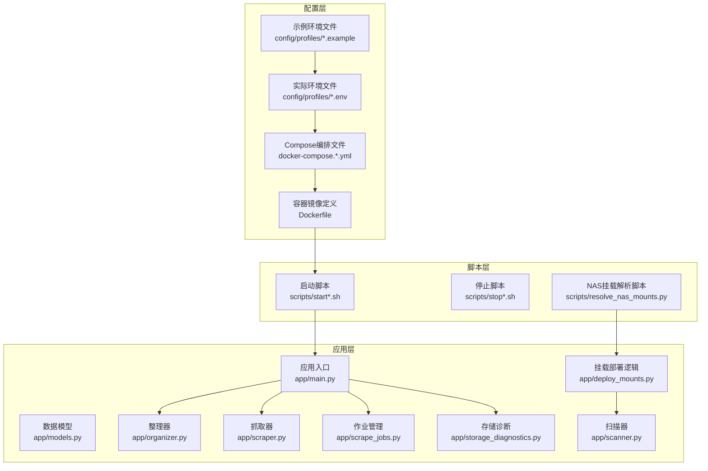
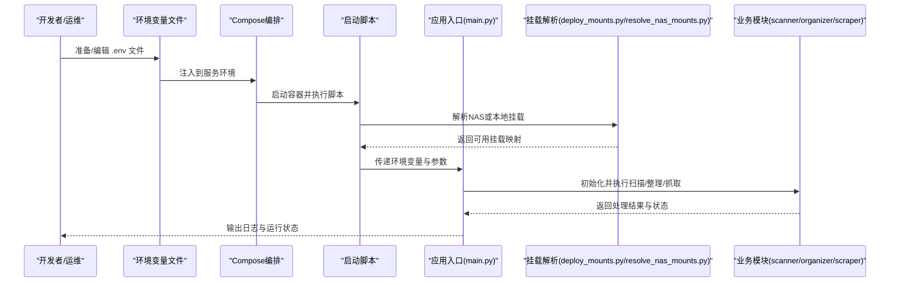
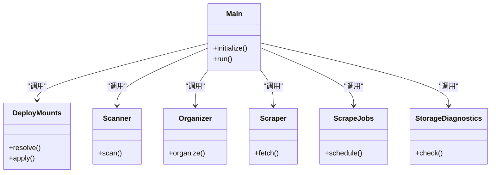

# 配置指南

<cite>
**本文引用的文件**
- [local.env.example](file://config/profiles/local.env.example)
- [nas.env.example](file://config/profiles/nas.env.example)
- [local.env](file://config/profiles/local.env)
- [nas.env](file://config/profiles/nas.env)
- [docker-compose.yml](file://docker-compose.yml)
- [docker-compose.nas.yml](file://docker-compose.nas.yml)
- [docker-compose.nas-image.yml](file://docker-compose.nas-image.yml)
- [docker-compose.nas-shared-root.yml](file://docker-compose.nas-shared-root.yml)
- [docker-compose.nas-image-shared-root.yml](file://docker-compose.nas-image-shared-root.yml)
- [Dockerfile](file://Dockerfile)
- [start.sh](file://scripts/start.sh)
- [start-local.sh](file://scripts/start-local.sh)
- [start-noctra-nas.sh](file://scripts/start-noctra-nas.sh)
- [stop.sh](file://scripts/stop.sh)
- [stop-noctra-nas.sh](file://scripts/stop-noctra-nas.sh)
- [resolve_nas_mounts.py](file://scripts/resolve_nas_mounts.py)
- [deploy_mounts.py](file://app/deploy_mounts.py)
- [main.py](file://app/main.py)
- [models.py](file://app/models.py)
- [organizer.py](file://app/organizer.py)
- [scanner.py](file://app/scanner.py)
- [scrape_jobs.py](file://app/scrape_jobs.py)
- [scraper.py](file://app/scraper.py)
- [storage_diagnostics.py](file://app/storage_diagnostics.py)
- [README.en.md](file://README.en.md)
- [local-startup.md](file://docs/local-startup.md)
- [nas-deployment.md](file://docs/nas-deployment.md)
- [phase1-delivery.md](file://docs/phase1-delivery.md)
- [phase1-validation.md](file://docs/phase1-validation.md)
- [runtime-workflow.md](file://docs/runtime-workflow.md)
- [scraping-mvp-definition.md](file://docs/scraping-mvp-definition.md)
</cite>

## 目录
1. [简介](#简介)
2. [项目结构](#项目结构)
3. [核心组件](#核心组件)
4. [架构总览](#架构总览)
5. [详细组件分析](#详细组件分析)
6. [依赖关系分析](#依赖关系分析)
7. [性能考量](#性能考量)
8. [故障排查指南](#故障排查指南)
9. [结论](#结论)
10. [附录](#附录)

## 简介
本指南面向Noctra配置系统的使用者与运维人员，系统性阐述以下内容：
- 各类配置文件的作用、参数含义与设置方法
- 本地开发、NAS部署与Docker容器三种部署场景的完整配置示例
- 挂载点配置、网络设置与环境变量的作用机制
- 不同部署场景的最佳实践与安全建议
- 配置验证、调试技巧与常见错误的解决方案

Noctra通过环境变量驱动运行时行为，并结合Compose编排实现多场景部署；同时提供脚本与诊断模块辅助挂载解析与存储状态检查。

## 项目结构
Noctra的配置体系围绕“环境变量 + Compose编排 + 应用启动脚本”展开，关键位置如下：
- 配置文件：位于 config/profiles 下的示例与实际环境文件
- 编排文件：位于根目录的 docker-compose.*.yml
- 容器镜像：Dockerfile
- 启动与停止脚本：scripts/ 目录下的 start*.sh、stop*.sh 及 NAS专用脚本
- 运行时逻辑：app/ 目录下各模块负责扫描、整理、抓取与存储诊断等

图表来源
- [docker-compose.yml](file://docker-compose.yml)
- [Dockerfile](file://Dockerfile)
- [start.sh](file://scripts/start.sh)
- [resolve_nas_mounts.py](file://scripts/resolve_nas_mounts.py)
- [deploy_mounts.py](file://app/deploy_mounts.py)
- [main.py](file://app/main.py)

章节来源
- [docker-compose.yml](file://docker-compose.yml)
- [Dockerfile](file://Dockerfile)
- [start.sh](file://scripts/start.sh)
- [resolve_nas_mounts.py](file://scripts/resolve_nas_mounts.py)
- [deploy_mounts.py](file://app/deploy_mounts.py)
- [main.py](file://app/main.py)

## 核心组件
本节聚焦配置相关的四大核心组件及其职责：
- 环境变量与配置文件：定义运行参数（如数据库连接、日志级别、抓取目标、挂载路径等）
- Compose编排：将服务、卷、网络与环境变量组合为可复现的部署拓扑
- 启动脚本：加载环境、解析挂载、启动主进程
- 应用模块：根据配置执行扫描、整理、抓取与诊断

章节来源
- [local.env.example](file://config/profiles/local.env.example)
- [nas.env.example](file://config/profiles/nas.env.example)
- [docker-compose.yml](file://docker-compose.yml)
- [start.sh](file://scripts/start.sh)
- [main.py](file://app/main.py)

## 架构总览
Noctra的配置驱动架构以“环境变量为中心”，通过Compose在不同环境中注入变量，脚本在启动前完成挂载解析，应用模块按配置执行业务流程。

图表来源
- [docker-compose.yml](file://docker-compose.yml)
- [start.sh](file://scripts/start.sh)
- [resolve_nas_mounts.py](file://scripts/resolve_nas_mounts.py)
- [deploy_mounts.py](file://app/deploy_mounts.py)
- [main.py](file://app/main.py)

## 详细组件分析

### 1) 环境变量与配置文件
- 作用：集中定义运行时参数，包括数据库、日志、抓取目标、挂载路径、网络代理等
- 示例文件：
  - 本地开发示例：config/profiles/local.env.example
  - NAS部署示例：config/profiles/nas.env.example
- 实际文件：
  - 本地开发：config/profiles/local.env
  - NAS部署：config/profiles/nas.env

建议：
- 在本地开发时，优先使用 local.env.example 生成 local.env 并按需修改
- 在NAS部署时，基于 nas.env.example 生成 nas.env 并确保挂载路径与NAS一致
- 所有敏感信息（如密钥）应避免提交到版本控制，使用 .gitignore 已保护

章节来源
- [local.env.example](file://config/profiles/local.env.example)
- [nas.env.example](file://config/profiles/nas.env.example)
- [local.env](file://config/profiles/local.env)
- [nas.env](file://config/profiles/nas.env)

### 2) Compose编排与容器化配置
- 核心编排文件：
  - docker-compose.yml：通用开发/测试编排
  - docker-compose.nas.yml：NAS专用编排（含NAS卷与网络策略）
  - docker-compose.nas-image.yml：仅镜像共享场景的编排
  - docker-compose.nas-shared-root.yml：共享根目录场景的编排
  - docker-compose.nas-image-shared-root.yml：镜像+共享根目录场景的编排
- 关键点：
  - 通过 volumes 将宿主机目录映射到容器内，用于媒体库扫描与输出
  - 通过 environment 注入环境变量，覆盖默认值
  - 通过 networks 定义服务间通信与访问策略

最佳实践：
- 开发/测试：使用 docker-compose.yml，便于快速迭代
- NAS部署：选择与实际挂载策略匹配的 compose 文件
- 镜像共享：当需要跨容器共享抓取产物时，选用带“image”后缀的编排

章节来源
- [docker-compose.yml](file://docker-compose.yml)
- [docker-compose.nas.yml](file://docker-compose.nas.yml)
- [docker-compose.nas-image.yml](file://docker-compose.nas-image.yml)
- [docker-compose.nas-shared-root.yml](file://docker-compose.nas-shared-root.yml)
- [docker-compose.nas-image-shared-root.yml](file://docker-compose.nas-image-shared-root.yml)

### 3) 启动与停止脚本
- 脚本职责：
  - 加载 .env 文件
  - 解析NAS挂载（resolve_nas_mounts.py）
  - 启动/停止应用容器与服务
- 常用脚本：
  - scripts/start.sh：通用启动
  - scripts/start-local.sh：本地开发启动
  - scripts/start-noctra-nas.sh：NAS启动
  - scripts/stop.sh：通用停止
  - scripts/stop-noctra-nas.sh：NAS停止

操作要点：
- 启动前确保 .env 已正确生成且权限合适
- NAS场景下先执行挂载解析，再启动服务
- 停止时按场景选择对应脚本，确保资源释放

章节来源
- [start.sh](file://scripts/start.sh)
- [start-local.sh](file://scripts/start-local.sh)
- [start-noctra-nas.sh](file://scripts/start-noctra-nas.sh)
- [stop.sh](file://scripts/stop.sh)
- [stop-noctra-nas.sh](file://scripts/stop-noctra-nas.sh)
- [resolve_nas_mounts.py](file://scripts/resolve_nas_mounts.py)

### 4) 应用模块与配置交互
- 入口与初始化：app/main.py
- 挂载部署：app/deploy_mounts.py（与NAS解析脚本协同）
- 数据模型：app/models.py（受数据库配置影响）
- 扫描与整理：app/scanner.py、app/organizer.py
- 抓取与作业：app/scraper.py、app/scrape_jobs.py
- 存储诊断：app/storage_diagnostics.py（校验挂载与空间）

图表来源
- [main.py](file://app/main.py)
- [deploy_mounts.py](file://app/deploy_mounts.py)
- [scanner.py](file://app/scanner.py)
- [organizer.py](file://app/organizer.py)
- [scraper.py](file://app/scraper.py)
- [scrape_jobs.py](file://app/scrape_jobs.py)
- [storage_diagnostics.py](file://app/storage_diagnostics.py)

章节来源
- [main.py](file://app/main.py)
- [deploy_mounts.py](file://app/deploy_mounts.py)
- [scanner.py](file://app/scanner.py)
- [organizer.py](file://app/organizer.py)
- [scraper.py](file://app/scraper.py)
- [scrape_jobs.py](file://app/scrape_jobs.py)
- [storage_diagnostics.py](file://app/storage_diagnostics.py)

### 5) 挂载点配置与NAS部署
- 挂载解析脚本：scripts/resolve_nas_mounts.py
- 挂载部署逻辑：app/deploy_mounts.py
- NAS部署文档：docs/nas-deployment.md
- 相关Compose文件：docker-compose.nas*.yml

配置要点：
- 映射宿主机媒体库目录到容器内固定路径
- 确保用户权限与读写权限一致
- 对于共享根目录或镜像共享场景，选择对应的编排文件

章节来源
- [resolve_nas_mounts.py](file://scripts/resolve_nas_mounts.py)
- [deploy_mounts.py](file://app/deploy_mounts.py)
- [nas-deployment.md](file://docs/nas-deployment.md)
- [docker-compose.nas.yml](file://docker-compose.nas.yml)
- [docker-compose.nas-image.yml](file://docker-compose.nas-image.yml)
- [docker-compose.nas-shared-root.yml](file://docker-compose.nas-shared-root.yml)
- [docker-compose.nas-image-shared-root.yml](file://docker-compose.nas-image-shared-root.yml)

### 6) 网络设置与代理
- Compose中通过 networks 定义服务网络
- 代理与网络访问可通过环境变量控制（如HTTP_PROXY/HTTPS_PROXY）
- 文档 runtime-workflow.md 提供运行时工作流说明

章节来源
- [docker-compose.yml](file://docker-compose.yml)
- [runtime-workflow.md](file://docs/runtime-workflow.md)

### 7) 环境变量的作用与参数说明
- 数据库连接：影响 app/models.py 的连接与迁移
- 日志级别：影响运行时日志输出
- 抓取目标与代理：影响 app/scraper.py 与 app/scrape_jobs.py 的行为
- 挂载路径：影响 app/scanner.py 与 app/organizer.py 的扫描与整理范围
- NAS相关参数：影响 scripts/resolve_nas_mounts.py 与 app/deploy_mounts.py 的解析与应用

章节来源
- [models.py](file://app/models.py)
- [scanner.py](file://app/scanner.py)
- [organizer.py](file://app/organizer.py)
- [scraper.py](file://app/scraper.py)
- [scrape_jobs.py](file://app/scrape_jobs.py)
- [resolve_nas_mounts.py](file://scripts/resolve_nas_mounts.py)
- [deploy_mounts.py](file://app/deploy_mounts.py)

## 依赖关系分析
- 配置对编排的依赖：Compose将 .env 中的环境变量注入容器
- 编排对镜像的依赖：Dockerfile 定义镜像基础与构建步骤
- 脚本对配置的依赖：启动脚本在运行前加载 .env 并解析挂载
- 应用模块对配置的依赖：各模块在初始化阶段读取环境变量并据此执行

图表来源
- [docker-compose.yml](file://docker-compose.yml)
- [Dockerfile](file://Dockerfile)
- [start.sh](file://scripts/start.sh)
- [main.py](file://app/main.py)

章节来源
- [docker-compose.yml](file://docker-compose.yml)
- [Dockerfile](file://Dockerfile)
- [start.sh](file://scripts/start.sh)
- [main.py](file://app/main.py)

## 性能考量
- 挂载路径优化：尽量减少深层嵌套与大量小文件，提升扫描与整理效率
- 并发与限速：合理配置抓取并发与速率限制，避免对源站点与本地磁盘造成过大压力
- 存储诊断：定期运行 app/storage_diagnostics.py，监控空间与权限问题
- 日志级别：生产环境建议降低日志级别，减少I/O开销

## 故障排查指南
- 配置验证
  - 使用 app/storage_diagnostics.py 校验挂载与存储状态
  - 通过 app/deploy_mounts.py 的解析结果确认挂载是否生效
- 常见问题与解决
  - 挂载权限不足：检查宿主机权限与容器内用户映射
  - 网络代理未生效：确认环境变量是否正确注入到容器
  - NAS挂载解析失败：核对 scripts/resolve_nas_mounts.py 的输入参数与NAS可达性
- 调试技巧
  - 逐步执行启动脚本，观察每一步输出
  - 查看应用日志，定位具体模块异常
  - 使用 docker-compose logs 查看容器日志

章节来源
- [storage_diagnostics.py](file://app/storage_diagnostics.py)
- [deploy_mounts.py](file://app/deploy_mounts.py)
- [resolve_nas_mounts.py](file://scripts/resolve_nas_mounts.py)
- [start.sh](file://scripts/start.sh)

## 结论
Noctra的配置体系以环境变量为核心，配合Compose编排与启动脚本，在本地开发、NAS部署与容器化场景下提供灵活且可复现的运行方式。通过规范的配置文件、清晰的挂载策略与完善的诊断工具，用户可以高效地完成从开发到生产的全链路配置与运维。

## 附录
- 参考文档
  - README.en.md：项目总体介绍与背景
  - local-startup.md：本地启动流程与注意事项
  - nas-deployment.md：NAS部署流程与最佳实践
  - phase1-delivery.md / phase1-validation.md：阶段性交付与验证说明
  - runtime-workflow.md：运行时工作流与配置交互
  - scraping-mvp-definition.md：抓取MVP定义与配置边界

章节来源
- [README.en.md](file://README.en.md)
- [local-startup.md](file://docs/local-startup.md)
- [nas-deployment.md](file://docs/nas-deployment.md)
- [phase1-delivery.md](file://docs/phase1-delivery.md)
- [phase1-validation.md](file://docs/phase1-validation.md)
- [runtime-workflow.md](file://docs/runtime-workflow.md)
- [scraping-mvp-definition.md](file://docs/scraping-mvp-definition.md)