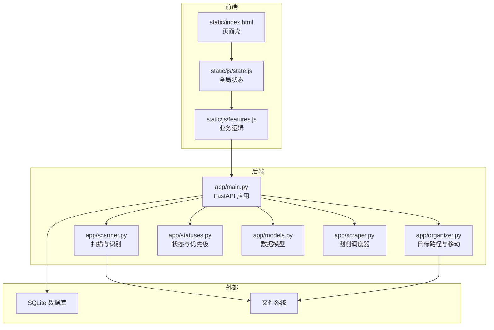
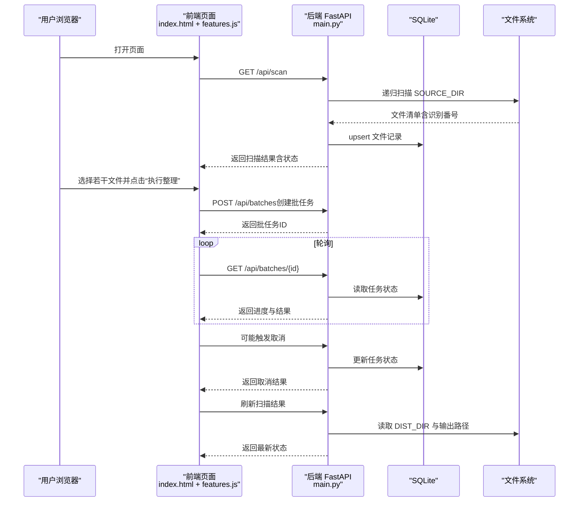
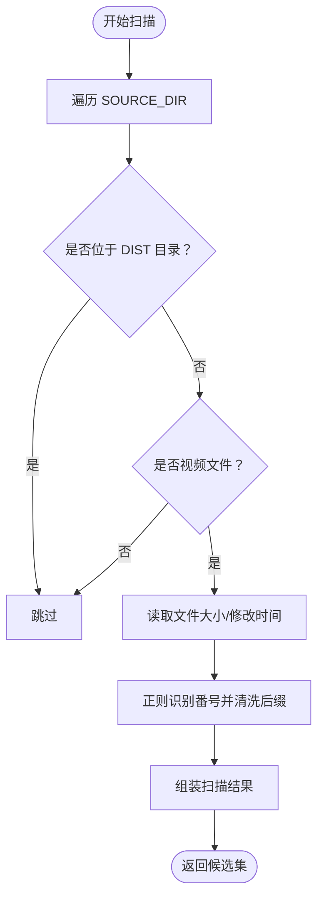
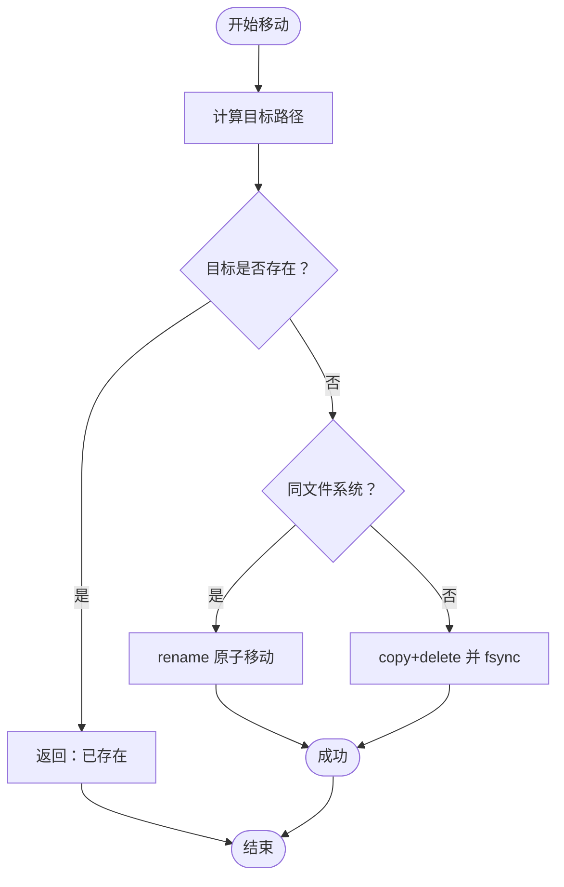
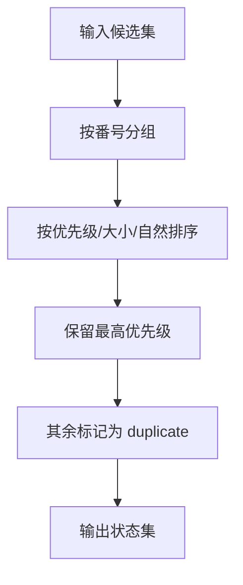
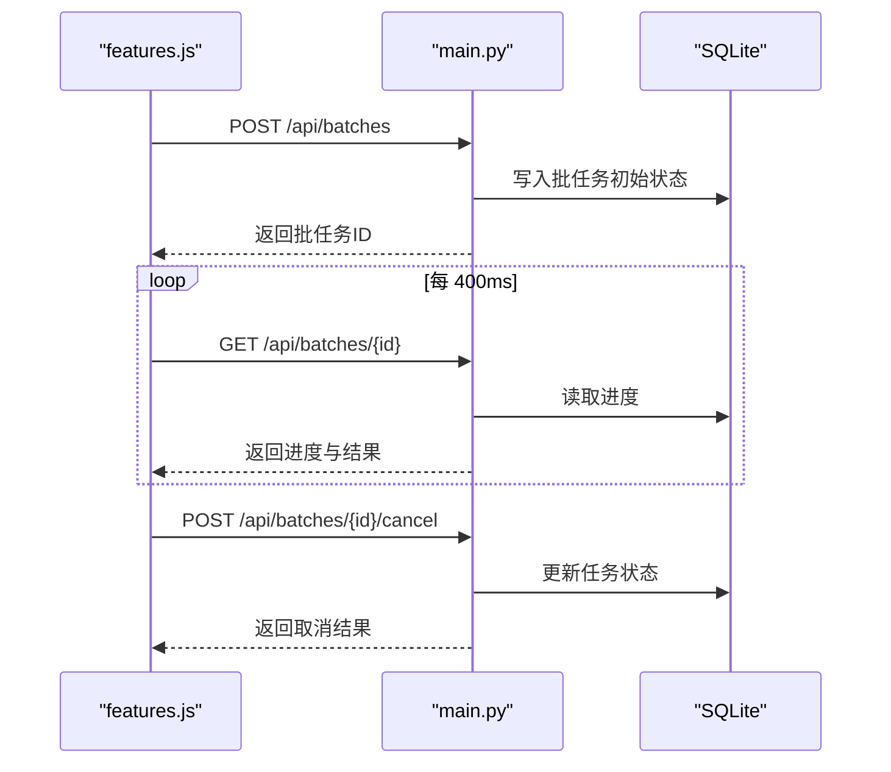
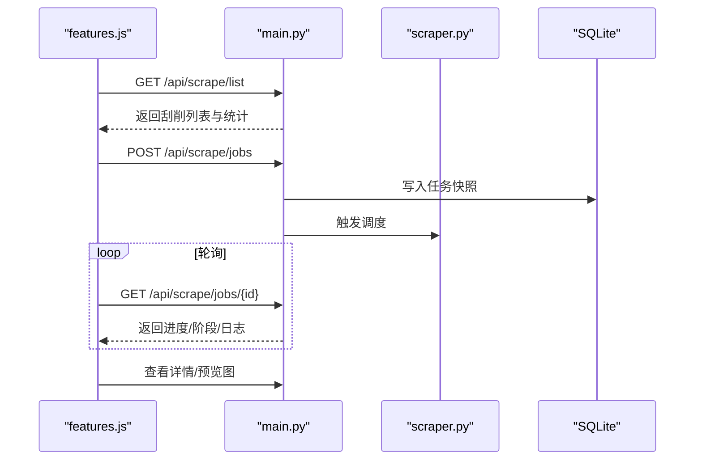
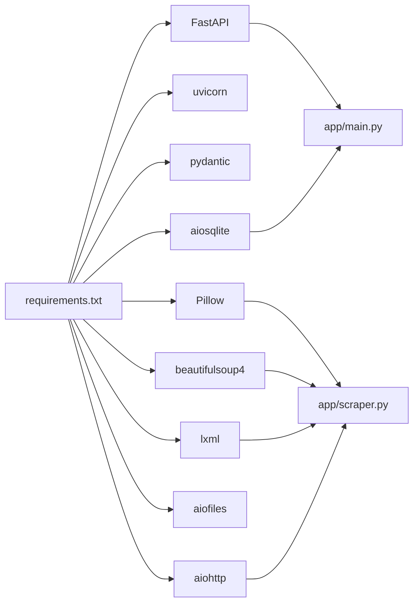

# 项目概览

<cite>
**本文引用的文件**
- [README.en.md](file://README.en.md)
- [app/main.py](file://app/main.py)
- [app/models.py](file://app/models.py)
- [app/scanner.py](file://app/scanner.py)
- [app/organizer.py](file://app/organizer.py)
- [app/statuses.py](file://app/statuses.py)
- [app/scraper.py](file://app/scraper.py)
- [docs/project-overview.md](file://docs/project-overview.md)
- [docs/current-state.md](file://docs/current-state.md)
- [docs/roadmap-next.md](file://docs/roadmap-next.md)
- [docs/phase1-delivery.md](file://docs/phase1-delivery.md)
- [requirements.txt](file://requirements.txt)
- [Dockerfile](file://Dockerfile)
- [static/index.html](file://static/index.html)
- [static/js/state.js](file://static/js/state.js)
- [static/js/features.js](file://static/js/features.js)
</cite>

## 目录
1. [简介](#简介)
2. [项目结构](#项目结构)
3. [核心组件](#核心组件)
4. [架构总览](#架构总览)
5. [详细组件分析](#详细组件分析)
6. [依赖关系分析](#依赖关系分析)
7. [性能考量](#性能考量)
8. [故障排查指南](#故障排查指南)
9. [结论](#结论)
10. [附录](#附录)

## 简介
Noctra 是一款面向本地与 NAS 的 JAV 文件整理工具，核心目标是将“杂乱目录中的视频文件”整理为“可预览、可确认、可追踪”的标准结构。项目强调“先预览，再整理”的可见性与可控性，提供扫描、确认、批量整理与历史回溯的完整工作流，并为后续的元数据刮削能力预留了数据与交互结构。

- 定位：家庭媒体管理的本地/NAS 工作台，聚焦 JAV 番号识别与标准化整理。
- 价值主张：透明、可控、可追踪、可扩展；支持本地、Docker 与 NAS 部署。
- 当前能力：扫描识别、目标路径预览、批量整理、历史记录、刮削能力 MVP 预留。
- 发展方向：稳定现有闭环后，逐步接入元数据刮削与更丰富的 UI/交互。

**章节来源**
- [README.en.md:1-87](file://README.en.md#L1-L87)
- [docs/project-overview.md:1-163](file://docs/project-overview.md#L1-L163)

## 项目结构
项目采用“后端 FastAPI + 前端静态页面（Alpine.js + 原生 JS 模块）”的轻量架构，核心模块如下：

- 后端 app/
  - main.py：FastAPI 应用入口、数据库初始化、路由与批任务调度
  - scanner.py：递归扫描与 JAV 番号识别
  - organizer.py：目标路径生成与文件移动（含跨盘回退）
  - statuses.py：扫描状态解析、重复项判定与优先级排序
  - models.py：Pydantic 数据模型（文件记录、批任务、刮削相关）
  - scraper.py：刮削调度器（MVP 阶段）
- 前端 static/
  - index.html：页面壳与 Alpine.js 驱动的视图
  - js/state.js：全局状态与统计
  - js/features.js：业务逻辑（扫描、整理、批任务轮询、刮削）
  - css/index.css：样式
- 文档 docs/
  - 项目概览、当前状态、路线图、Phase 1 交付等
- 部署与运行
  - requirements.txt：Python 依赖
  - Dockerfile：容器镜像构建
  - docker-compose.*：多场景编排

**图表来源**
- [app/main.py:58-130](file://app/main.py#L58-L130)
- [app/scanner.py:67-125](file://app/scanner.py#L67-L125)
- [app/organizer.py:85-163](file://app/organizer.py#L85-L163)
- [app/statuses.py:24-104](file://app/statuses.py#L24-L104)
- [app/models.py:7-216](file://app/models.py#L7-L216)
- [app/scraper.py:1-200](file://app/scraper.py#L1-L200)
- [static/index.html:10-800](file://static/index.html#L10-L800)
- [static/js/state.js:20-676](file://static/js/state.js#L20-L676)
- [static/js/features.js:7-800](file://static/js/features.js#L7-L800)

**章节来源**
- [README.en.md:58-87](file://README.en.md#L58-L87)
- [docs/project-overview.md:36-80](file://docs/project-overview.md#L36-L80)

## 核心组件
- 扫描与识别（JAVScanner）
  - 递归扫描 SOURCE_DIR，跳过 DIST_DIR
  - 识别规则：支持多段字母数字 + 连字符 + 数字结尾，去除 -C/-UC/字幕版/Uncensored 等后缀
  - 输出：文件路径、文件名、识别出的番号、大小与修改时间
- 整理与移动（JAVOrganizer）
  - 目录：纯番号命名；文件名：保留 -C/-UC 等语义后缀，清洗冗余文本
  - 移动策略：同盘优先 rename 原子移动，跨盘降级为 copy+delete 并 fsync 保证落盘
- 状态与优先级（statuses）
  - 扫描状态：pending/target_exists/skipped（映射为“待处理/已存在/未识别”）
  - 重复项处理：同一番号候选按 UC/C/SUB/PLAIN 优先级与大小、自然排序确定保留项
- 批任务与进度（main + features）
  - 批任务模型：job 状态（queued/running/completed/failed/cancelled），逐项状态（pending/processing/success/skipped/failed）
  - 前端轮询：约 400ms 轮询 /api/batches/{id}，实时更新面板与行内状态
- 刮削能力（scraper + models）
  - 数据模型预留：scrape_status、scrape_started_at/scrape_finished_at、scrape_stage、scrape_source、scrape_error 等
  - UI 入口：刮削标签页，支持批量刮削、失败项查看与重试路径预留

**章节来源**
- [app/scanner.py:32-125](file://app/scanner.py#L32-L125)
- [app/organizer.py:18-215](file://app/organizer.py#L18-L215)
- [app/statuses.py:24-104](file://app/statuses.py#L24-L104)
- [app/main.py:531-614](file://app/main.py#L531-L614)
- [static/js/features.js:218-261](file://static/js/features.js#L218-L261)
- [app/models.py:103-216](file://app/models.py#L103-L216)
- [app/scraper.py:1-200](file://app/scraper.py#L1-L200)

## 架构总览
Noctra 采用“单体后端 + 静态前端”的轻量架构：
- 后端：FastAPI 提供 REST API，aiosqlite + SQLite 存储文件记录与刮削元数据
- 前端：Alpine.js 驱动的 SPA，通过 fetch 与后端交互，批任务与刮削任务通过轮询更新
- 存储：SOURCE_DIR（扫描）、DIST_DIR（输出）、DB_PATH（SQLite）

**图表来源**
- [app/main.py:739-808](file://app/main.py#L739-L808)
- [static/js/features.js:218-261](file://static/js/features.js#L218-L261)
- [static/js/features.js:704-751](file://static/js/features.js#L704-L751)

**章节来源**
- [docs/project-overview.md:36-80](file://docs/project-overview.md#L36-L80)
- [app/main.py:58-130](file://app/main.py#L58-L130)

## 详细组件分析

### 扫描与识别（JAVScanner）
- 关键点
  - 递归遍历 + 跳过 DIST_DIR
  - 正则匹配“字母/数字/连字符”构成的番号，去除 -C/-UC/字幕版/Uncensored 等后缀
  - 输出包含路径、文件名、识别番号、文件大小与修改时间
- 性能与健壮性
  - 避免非视频扩展名与 DIST 目录，减少 IO
  - 对异常路径与权限问题进行容错

**图表来源**
- [app/scanner.py:67-125](file://app/scanner.py#L67-L125)

**章节来源**
- [app/scanner.py:32-125](file://app/scanner.py#L32-L125)

### 整理与移动（JAVOrganizer）
- 关键点
  - 目录：纯番号；文件名：保留 -C/-UC 等语义后缀，清洗冗余文本
  - 移动策略：rename 原子移动优先，跨盘捕获 EXDEV 降级为 copy+delete 并 fsync
- 错误处理
  - 目标已存在：跳过并返回“已存在”
  - 源不存在或 IO 异常：返回失败原因

**图表来源**
- [app/organizer.py:122-163](file://app/organizer.py#L122-L163)

**章节来源**
- [app/organizer.py:85-215](file://app/organizer.py#L85-L215)

### 状态与优先级（statuses）
- 关键点
  - resolve_scan_status：未识别为“未识别”，目标已存在为“已存在”，否则为“待处理”
  - 重复项处理：同一番号按 UC/C/SUB/PLAIN 优先级与大小、自然排序确定保留项
- 复杂度
  - 分组与排序：O(n log n)，主要由自然排序与大小比较决定

**图表来源**
- [app/statuses.py:83-104](file://app/statuses.py#L83-L104)

**章节来源**
- [app/statuses.py:24-104](file://app/statuses.py#L24-L104)

### 批任务与进度（main + features）
- 关键点
  - 批任务模型：job 状态与逐项状态，前端轮询更新
  - 乐观 UI：创建批任务即显示面板，随后拉取真实状态
  - 取消与失败：支持取消与失败项保留，便于继续筛选与处理
- 交互细节
  - 最小展示时间、展开动画、面板折叠态与终态文案

**图表来源**
- [static/js/features.js:218-261](file://static/js/features.js#L218-L261)
- [app/main.py:531-614](file://app/main.py#L531-L614)

**章节来源**
- [static/js/features.js:97-177](file://static/js/features.js#L97-L177)
- [static/js/features.js:218-261](file://static/js/features.js#L218-L261)
- [app/main.py:531-614](file://app/main.py#L531-L614)

### 刮削能力（scraper + models）
- 数据模型预留
  - scrape_status/scrape_started_at/scrape_finished_at/scrape_stage/scrape_source/scrape_error/scrape_logs 等
- UI 入口与交互
  - 刮削标签页、批量刮削、失败项详情查看、预览图浏览、NSFW 图片遮罩
- 进度与日志
  - 事件驱动的阶段推进与日志聚合，支持最近日志展示

**图表来源**
- [app/models.py:103-216](file://app/models.py#L103-L216)
- [static/js/features.js:433-468](file://static/js/features.js#L433-L468)
- [app/main.py:347-399](file://app/main.py#L347-L399)
- [app/scraper.py:1-200](file://app/scraper.py#L1-L200)

**章节来源**
- [app/models.py:103-216](file://app/models.py#L103-L216)
- [static/js/features.js:572-600](file://static/js/features.js#L572-L600)
- [app/main.py:347-399](file://app/main.py#L347-L399)
- [app/scraper.py:1-200](file://app/scraper.py#L1-L200)

## 依赖关系分析
- 技术栈
  - 后端：FastAPI、aiosqlite、SQLite
  - 前端：Alpine.js、原生 JS 模块、静态资源
  - 其他：BeautifulSoup、lxml、aiohttp、Pillow 等用于刮削与图像处理
- 外部依赖与集成
  - 文件系统：扫描与移动
  - SQLite：文件记录与刮削元数据
  - 网络：刮削源（MVP 阶段）

**图表来源**
- [requirements.txt:1-12](file://requirements.txt#L1-L12)

**章节来源**
- [requirements.txt:1-12](file://requirements.txt#L1-L12)
- [Dockerfile:1-31](file://Dockerfile#L1-L31)

## 性能考量
- 扫描与识别
  - 递归遍历 + 跳过 DIST 目录，避免重复扫描
  - 正则匹配与字符串清洗为 O(n) 级别，瓶颈主要在 IO
- 整理与移动
  - 同盘 rename 原子移动，跨盘降级为 copy+delete 并 fsync，确保数据一致性
  - 大文件移动耗时较长，建议在同盘场景部署以提升性能
- 前端轮询
  - 批任务轮询间隔约 400ms，兼顾实时性与服务器压力
- 数据库
  - SQLite 适合本地/NAS 场景，注意避免高并发写入

[本节为通用指导，无需特定文件引用]

## 故障排查指南
- 服务无法启动
  - 检查 Python 版本与依赖安装
  - 端口占用与日志查看
- 扫描不到文件
  - 确认 SOURCE_DIR 挂载与权限
  - 检查视频扩展名是否在支持列表
- 整理失败
  - 检查 DIST_DIR 权限与磁盘空间
  - 查看服务日志定位错误
- 无法访问 Web 界面
  - 健康检查 /api/health
  - 确认服务绑定到 0.0.0.0

**章节来源**
- [docs/phase1-delivery.md:326-348](file://docs/phase1-delivery.md#L326-L348)

## 结论
Noctra 以“可见、可控、可追踪”为核心理念，构建了从扫描、确认到批量整理与历史回溯的完整工作流，并为元数据刮削预留了数据与交互结构。当前版本聚焦于稳定现有闭环，后续将基于成熟的批任务与记录页体系，逐步接入刮削能力，持续优化失败路径与 UI 体验。

[本节为总结性内容，无需特定文件引用]

## 附录
- 快速启动与典型工作流
  - 本地：虚拟环境安装依赖后运行 start.sh
  - Docker：容器映射 source/dist/data，暴露端口 8000（镜像默认）
  - NAS：docker-image + Watchtower 自动更新
- 典型流程
  - 打开 UI -> 点击“扫描目录” -> 预览识别与目标路径 -> 过滤/排序/分页/跨页勾选 -> 执行整理 -> 查看历史

**章节来源**
- [README.en.md:16-87](file://README.en.md#L16-L87)
- [docs/current-state.md:31-118](file://docs/current-state.md#L31-L118)
- [docs/project-overview.md:52-163](file://docs/project-overview.md#L52-L163)